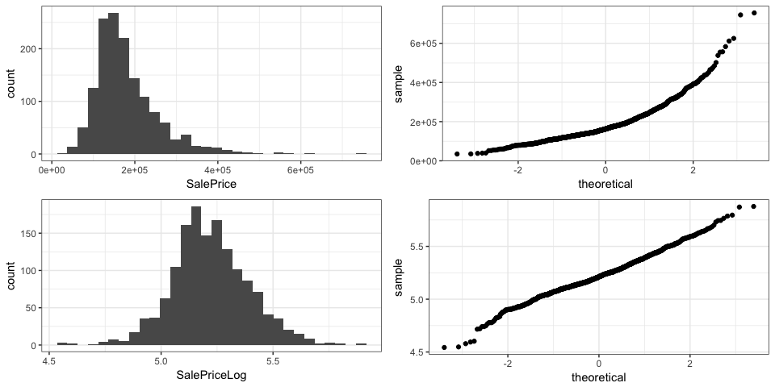
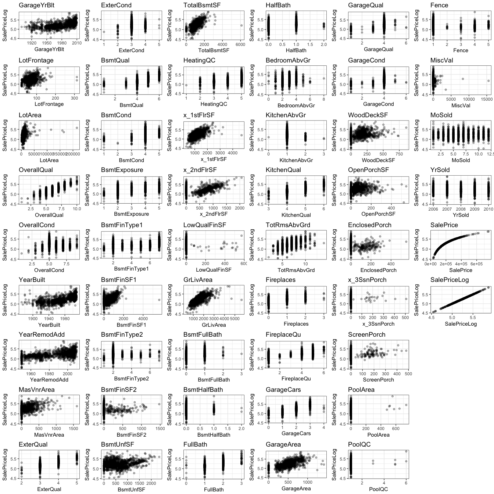
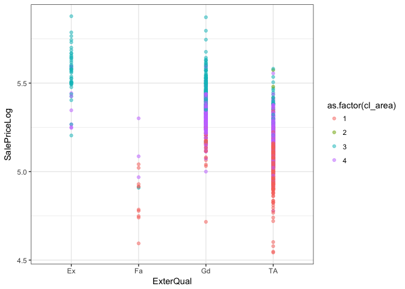
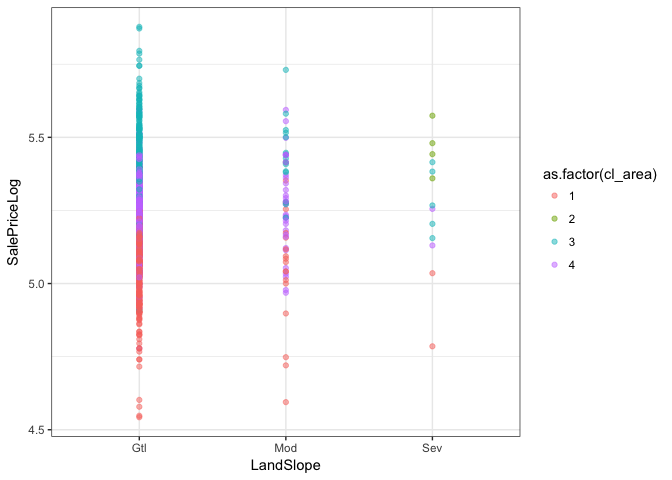
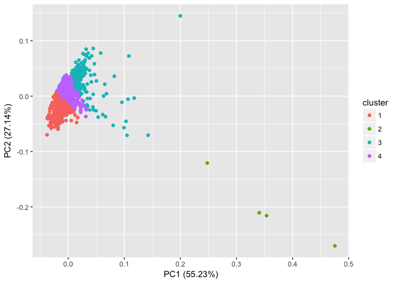
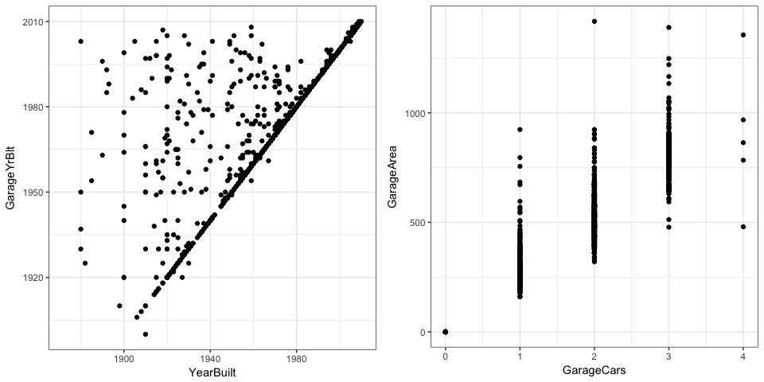

project ivy: House Prices (Kaggle) - EDA
================

Overview
--------

[House Prices: Advanced Regression Techniques](https://www.kaggle.com/c/house-prices-advanced-regression-techniques)

Let's get a feel for the data
-----------------------------

Let's load the data and implement the rules based on **data\_description.txt** and inspect the data

    ## Rows Cols 
    ## 2919   82

    ##        Variable Missing
    ## 1      MSZoning       4
    ## 2   LotFrontage     486
    ## 3     Utilities       2
    ## 4   Exterior1st       1
    ## 5   Exterior2nd       1
    ## 6    MasVnrType      24
    ## 7    MasVnrArea      23
    ## 8    BsmtFinSF1       1
    ## 9    BsmtFinSF2       1
    ## 10    BsmtUnfSF       1
    ## 11  TotalBsmtSF       1
    ## 12   Electrical       1
    ## 13 BsmtFullBath       2
    ## 14 BsmtHalfBath       2
    ## 15  KitchenQual       1
    ## 16   Functional       2
    ## 17  GarageYrBlt     159
    ## 18   GarageCars       1
    ## 19   GarageArea       1
    ## 20     SaleType       1
    ## 21    SalePrice    1459

There are 21 variables containing NA's. Note the following:

-   **SalesPrice** is missing because the **test** data was merged with the **train** data. That leaves us with 20 variables containing NA's.
-   **GarageYrBlt** will be NA if there is no garage on the property

Let's visualise missing 

    ##      Variable Missing
    ## 1 GarageYrBlt     159
    ## 2   SalePrice    1459

Visualisation
-------------

Notice **SalePrice** vs **SalePriceLog**. We'll be using **SalePriceLog** from now on.

    ## `stat_bin()` using `bins = 30`. Pick better value with `binwidth`.
    ## `stat_bin()` using `bins = 30`. Pick better value with `binwidth`.

### Numeric variables

Let's get an overview of the numeric variables 

When reading **data\_descr.txt** it is clear that some variables are highly correlated purely by definition. Let's explore those in detail and decide which to keep.

    ##              YearBuilt GarageYrBlt GarageCars GarageArea YearRemodAdd
    ## YearBuilt    1.0000000   0.8256675  0.5233495  0.4449505    0.6180581
    ## GarageYrBlt  0.8256675   1.0000000  0.5889200  0.5645671    0.6422768
    ## GarageCars   0.5233495   0.5889200  1.0000000  0.8314807    0.4506592
    ## GarageArea   0.4449505   0.5645671  0.8314807  1.0000000    0.3823228
    ## YearRemodAdd 0.6180581   0.6422768  0.4506592  0.3823228    1.0000000

 From the above we can see that there is a very high correlation between **YearBuilt** & **GarageYrBlt** as well as **GarageCars** & **GarageArea**. Another point to note is that each of **GarageYrBlt**, **GarageCars** & **GarageArea** indicates the lack of a garage on the property. Further we will use only **YearBuilt** and **GarageArea** as these variables contains info regarding the age of the property (and garage), if there is in fact a garage and its size.

It would make sense that bigger houses are more expensive. Let's cluster all area related variables and assess the impact of area on **SalePrice**

    ##                cl_area SalePriceLog
    ## cl_area      1.0000000    0.4767858
    ## SalePriceLog 0.4767858    1.0000000

### Categorical variables

 When reading **data\_descr.txt** it is clear that some variables are highly correlated purely by definition. Let's explore those in detail and decide which to keep.
