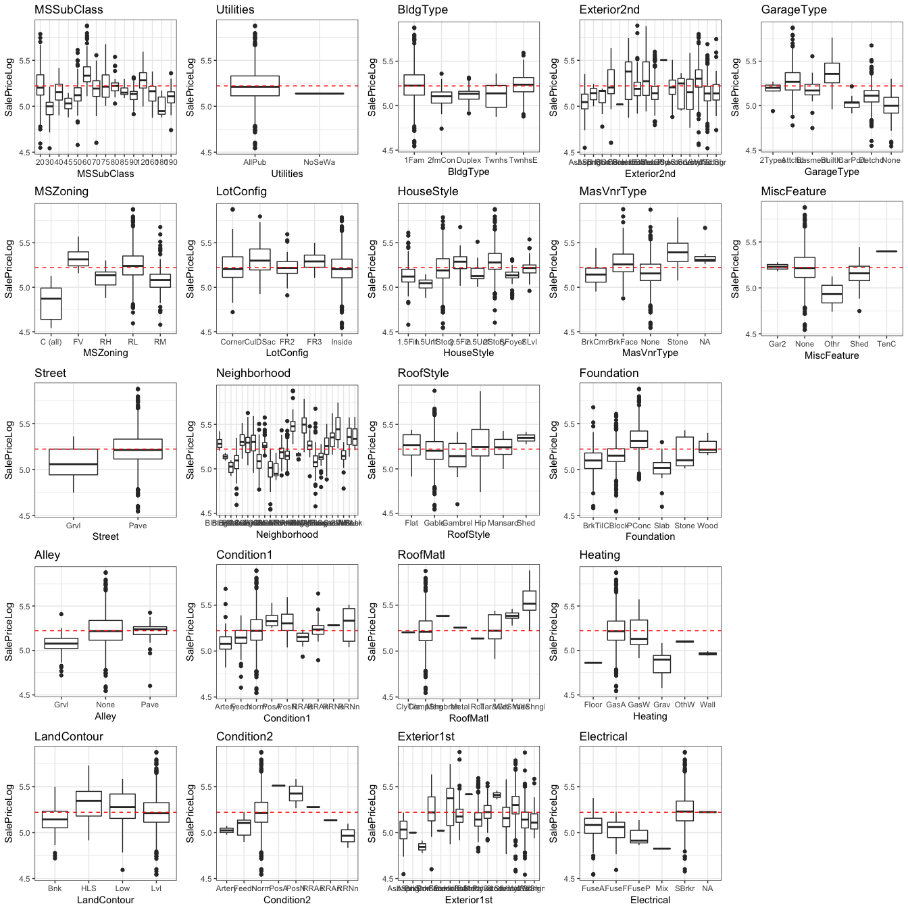
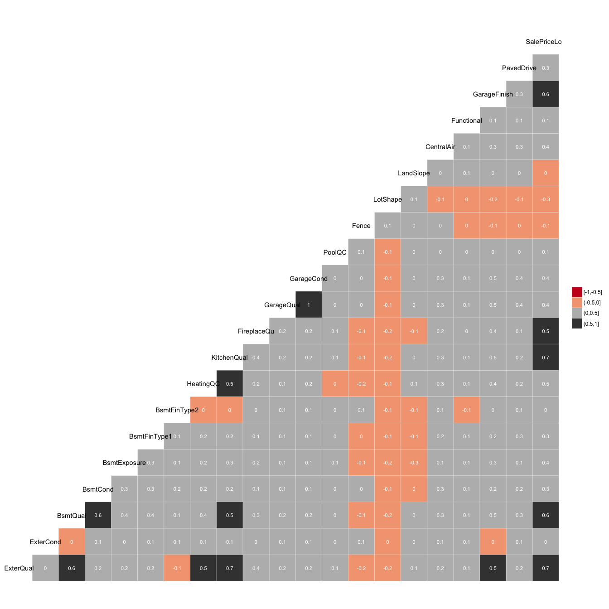
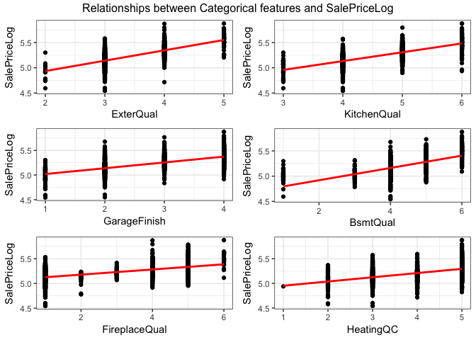
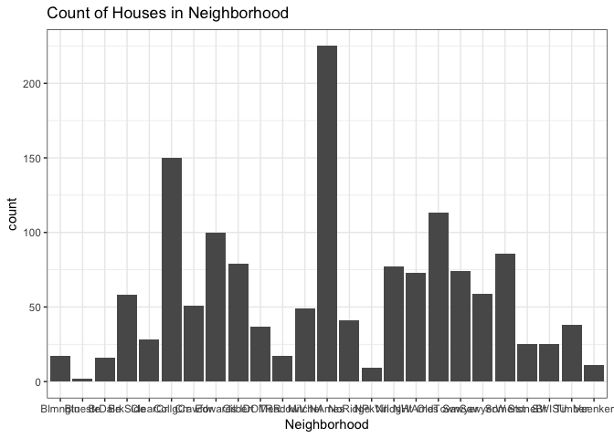
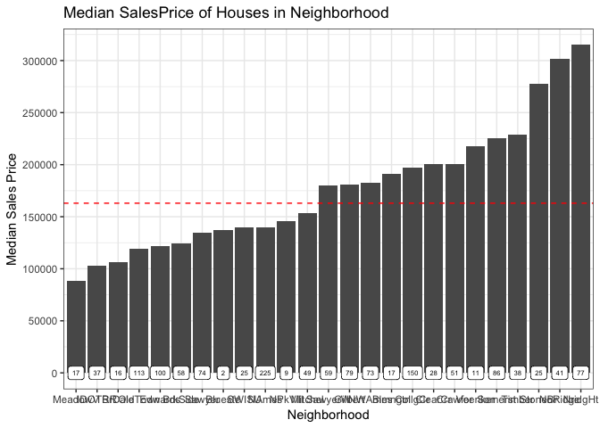
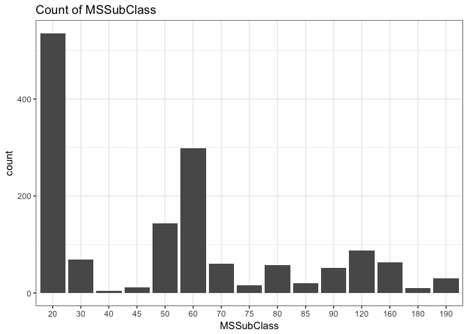
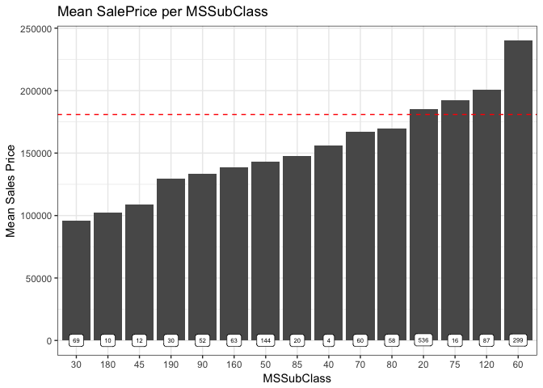

project ivy: House Prices (Kaggle) - EDA (Categorical)
================

Overview
--------

[House Prices: Advanced Regression Techniques](https://www.kaggle.com/c/house-prices-advanced-regression-techniques)

Now that we've had a look at the data, and dived into the numerical analysis. Let's take a deeper look into some of the categorical features.

Categorical variables
---------------------

The transformation of the categorical variables are enclosed in the **transform.R source** code. All Quality variables which had the same ordered levels that ranked the quality of the feature from None to Excellent were label encoded (maped to an integer representation) that reflected the order of the level. 0 = None, incrementally until 5 = Excellent. Additionally, there were varaibles that, by nature & definition, were ordered. These variables were also label encoded.

After considering the NA values in the dataset, we also came across a feature that was overwhlemingly populated by a single level. The Utilities variable, as we'll see displayed all house, except one, having all public utilities. Thus, this variable doesn't offer much enrichment for Preditcion & therefore removed. (Removed in feature\_eng.R code).

    ## 
    ## AllPub NoSeWa 
    ##   2916      1

Visualization of Categorical Variables (Boxplot)
------------------------------------------------

Let's visualize the boxplot of the categorical variables.

    ## Loading required package: grid

From the above graphs, there are definitely features that have similar shapes. However, there are also features that display significant variation and will be explored in more detail.

When reading **data\_descr.txt** it is clear that some variables are highly correlated purely by definition. Let's explore those in detail and decide which to keep.

Highly correlated by definition, results in the following 'grouped' variables:

-   Property Variables: Street, Alley, LotShape, LandContour, LandSlope, LotConfig
-   Dwelling/ Living Variables: BldgType, HouseStyle, MSSubClass, MSZoning, Neighborhood
-   Utility: Utilities, Electrical
-   Overall Quality & Condition: OverallQual, OverallCond, Functional
-   Material of House: OverallQual, RoofMatl, Exterior1st, Exterior2nd, MasVnrType, ExterQual, ExterCond, Foundation
-   Roof: RoofStyle, RoofMatl
-   Basement: BsmtQual, BsmtCond, BsmtExposure, BsmtFinType1, BsmtFinType2
-   Heating: Heating, HeatingQC, CentralAir, FireplaceQu
-   Garage: GarageType, GarageFinish, GarageQual, GarageCond, PavedDrive
-   Misc: PoolQC, Fence, MiscFeature, KitchenQual
-   Nature of Sale: SaleType, SaleCondition

Correlation of Label Encoded Features
-------------------------------------

Once variables had been label encoded, we could develop a Correlation Matrix to display the relationship between these variables.

    ##        set_id            Id    MSSubClass      MSZoning   LotFrontage 
    ##             0             0             0             4           486 
    ##       LotArea        Street         Alley      LotShape   LandContour 
    ##             0             0             0             0             0 
    ##     Utilities     LotConfig     LandSlope  Neighborhood    Condition1 
    ##             2             0             0             0             0 
    ##    Condition2      BldgType    HouseStyle   OverallQual   OverallCond 
    ##             0             0             0             0             0 
    ##     YearBuilt  YearRemodAdd     RoofStyle      RoofMatl   Exterior1st 
    ##             0             0             0             0             1 
    ##   Exterior2nd    MasVnrType    MasVnrArea     ExterQual     ExterCond 
    ##             1            24            23             0             0 
    ##    Foundation      BsmtQual      BsmtCond  BsmtExposure  BsmtFinType1 
    ##             0             0             0             0             0 
    ##    BsmtFinSF1  BsmtFinType2    BsmtFinSF2     BsmtUnfSF   TotalBsmtSF 
    ##             1             0             1             1             1 
    ##       Heating     HeatingQC    CentralAir    Electrical    x_1stFlrSF 
    ##             0             0             0             1             0 
    ##    x_2ndFlrSF  LowQualFinSF     GrLivArea  BsmtFullBath  BsmtHalfBath 
    ##             0             0             0             2             2 
    ##      FullBath      HalfBath  BedroomAbvGr  KitchenAbvGr   KitchenQual 
    ##             0             0             0             0             0 
    ##  TotRmsAbvGrd    Functional    Fireplaces   FireplaceQu    GarageType 
    ##             0             2             0             0             0 
    ##   GarageYrBlt  GarageFinish    GarageCars    GarageArea    GarageQual 
    ##           159             0             1             1             0 
    ##    GarageCond    PavedDrive    WoodDeckSF   OpenPorchSF EnclosedPorch 
    ##             0             0             0             0             0 
    ##   x_3SsnPorch   ScreenPorch      PoolArea        PoolQC         Fence 
    ##             0             0             0             0             0 
    ##   MiscFeature       MiscVal        MoSold        YrSold      SaleType 
    ##             0             0             0             0             1 
    ## SaleCondition     SalePrice  SalePriceLog 
    ##             0          1459          1459

    ## [1] 1460   21

From the above correlations, we can see a number of features which are strongly correlated to eachother. It seems to be a trend (intuitively) that the Quality and Condition of a feature show strong relationships. On top of that, we can see that BsmtQual had a strong relationship to KitchenQual, and ExterQual show significant relationships to BsmtQual, HeatingQC, KitchenQual, GarageFinish. We'll explore these relationships below.

Additionally, we can see that the features that contribute to SalePrice significantly are: GarageFinsih, FireplaceQC, KitchenQual, BsmtQual, ExterQual, (HeatingQC)

Let's visualize these relationships:

    ## 
    ## Attaching package: 'gridExtra'

    ## The following object is masked from 'package:dplyr':
    ## 
    ##     combine

From the above graphs, we can see a very clear and strong postive linear relationship between the feature and SalesPrice.

GoodmanKruskal Method
---------------------

To further explore the relationships between 2 categorical features, we will looks at the GoodmanKruskal tau values, which describe both the forward & backward association between these 2 variables. [GoodmanKruskal Tau](https://cran.r-project.org/web/packages/GoodmanKruskal/vignettes/GoodmanKruskal.html)

    ## Loading required package: GoodmanKruskal

    ##         xName          yName Nx Ny tauxy tauyx
    ## 1 df$BsmtQual df$KitchenQual  5  5 0.252 0.217

From the above table, we can see that there is an equal predictive relationship between these two features. But seems to hint that knowledge of the BsmtQual is predictive (more so) of the KitchenQual - however, not significantly enough to throw away either.

    ##          xName       yName Nx Ny tauxy tauyx
    ## 1 df$ExterQual df$BsmtQual  4  5 0.267 0.354

    ##          xName        yName Nx Ny tauxy tauyx
    ## 1 df$ExterQual df$HeatingQC  4  5 0.193 0.255

    ##          xName          yName Nx Ny tauxy tauyx
    ## 1 df$ExterQual df$KitchenQual  4  5 0.415 0.453

    ##          xName           yName Nx Ny tauxy tauyx
    ## 1 df$ExterQual df$GarageFinish  4  4 0.136 0.217

A surprising relationship is that of ExterQual to KitchenQual.

Feature Importance: Random Forest
---------------------------------

Let's look at a Random Forest model that will highlight the important features that form part of our dataset, and potentially inform our prediction models.

    ## randomForest 4.6-14

    ## Type rfNews() to see new features/changes/bug fixes.

    ## 
    ## Attaching package: 'randomForest'

    ## The following object is masked from 'package:gridExtra':
    ## 
    ##     combine

    ## The following object is masked from 'package:dplyr':
    ## 
    ##     combine

    ## The following object is masked from 'package:ggplot2':
    ## 
    ##     margin

    ##                   %IncMSE IncNodePurity
    ## set_id         0.00000000   0.000000000
    ## Id            -1.62085130   0.155755352
    ## MSSubClass    22.42633702   0.862198480
    ## MSZoning       9.56020857   0.213367615
    ## LotArea       17.94875137   0.533404748
    ## Street        -0.91596890   0.002985877
    ## Alley          0.52099744   0.024235232
    ## LotShape       3.14217371   0.040474375
    ## LandContour    1.42615909   0.057464844
    ## Utilities      0.00000000   0.000186652
    ## LotConfig     -0.94055351   0.042544639
    ## LandSlope      1.01286094   0.026370955
    ## Neighborhood  33.44493915   6.537928823
    ## Condition1     2.85345554   0.058215541
    ## Condition2    -1.47756687   0.004324657
    ## BldgType       5.47130376   0.032011037
    ## HouseStyle     9.40406985   0.098673910
    ## OverallQual   25.61062435   9.895127313
    ## OverallCond   14.21612998   0.298513255
    ## YearBuilt     10.58858733   1.551888182
    ## YearRemodAdd  14.34073060   0.356941634
    ## RoofStyle      3.31847347   0.044908642
    ## RoofMatl      -1.34074817   0.009391449
    ## Exterior1st   10.22772544   0.291872978
    ## Exterior2nd   10.13389273   0.348332766
    ## ExterQual     11.36883134   2.881221291
    ## ExterCond      1.85521196   0.064408752
    ## Foundation     5.30978037   0.083730410
    ## BsmtQual       7.90337725   0.951839492
    ## BsmtCond       6.42762944   0.068451022
    ## BsmtExposure   8.49666210   0.087056413
    ## BsmtFinType1  16.03694142   0.150590449
    ## BsmtFinSF1    20.19797921   0.625668839
    ## BsmtFinType2   1.32426553   0.028265810
    ## BsmtFinSF2    -0.37257810   0.022565384
    ## BsmtUnfSF      9.47623927   0.199252191
    ## TotalBsmtSF   25.08134710   1.723555440
    ## Heating       -0.95938666   0.022790289
    ## HeatingQC      6.13858431   0.075509359
    ## CentralAir     8.16771361   0.317011813
    ## x_1stFlrSF    25.76573183   1.429096426
    ## x_2ndFlrSF    17.43165893   0.532741673
    ## LowQualFinSF   1.08537865   0.007815918
    ## GrLivArea     35.82300425   5.056987507
    ## BsmtFullBath   8.61183429   0.063737683
    ## BsmtHalfBath   0.93617714   0.010593707
    ## FullBath       7.42536782   0.538026276
    ## HalfBath       9.23911652   0.041722256
    ## BedroomAbvGr   8.17311115   0.102997696
    ## KitchenAbvGr   4.43374542   0.016895030
    ## KitchenQual    9.49776975   1.341765142
    ## TotRmsAbvGrd  10.23064571   0.264061380
    ## Functional     4.43738678   0.056517886
    ## Fireplaces     9.21926473   0.309333646
    ## FireplaceQu   11.20285604   0.409872639
    ## GarageType    11.49432814   0.468158856
    ## GarageFinish   7.66195321   0.481635395
    ## GarageCars    12.56316783   1.336340240
    ## GarageArea    19.04668785   1.232943792
    ## GarageQual     4.21982708   0.079873302
    ## GarageCond     4.38795825   0.142886814
    ## PavedDrive     2.85413145   0.053930377
    ## WoodDeckSF     7.76469669   0.107892701
    ## OpenPorchSF    7.97274449   0.197077679
    ## EnclosedPorch  1.63740175   0.061194488
    ## x_3SsnPorch    0.58670365   0.006103717
    ## ScreenPorch    4.52013424   0.024055512
    ## PoolArea       1.38729072   0.004768739
    ## PoolQC         1.36909576   0.002560823
    ## Fence          1.84564465   0.026417091
    ## MiscFeature    0.38377182   0.006503870
    ## MiscVal       -0.77466297   0.007840936
    ## MoSold        -0.06638808   0.131400757
    ## YrSold         0.95353016   0.066657334
    ## SaleType       1.39061282   0.038553043
    ## SaleCondition  2.44566302   0.131550970

Considering non-ordinal categorical features
--------------------------------------------

From the list of of non-ordinal features, there are a couple that stand out and are worth exploring. (It's more art than science). Additionally, the 2 non-ordered categorical features highlighted from the RandomForest model that scored the highest value of importance were Neighborhood and MSSubClass - let's take a closer look.

    ## Joining, by = "Neighborhood"

    ##             xName         yName Nx Ny tauxy tauyx
    ## 1 df$Neighborhood df$MSSubClass 25 16 0.212 0.086

    ##             xName       yName Nx Ny tauxy tauyx
    ## 1 df$Neighborhood df$MSZoning 25  6 0.657 0.101

From the above we can see that knowledge of Neighborhood is predictive of MSSubClass, and signifanctly more of MSZoning.

Neighborhood
------------

One of the features I'm particularly interested in is the Neighborhood. From intuition, I know that neighborhood plays a pretty important role when someone is considering buying a house. More favourable Neighborhoods are likely to have higher SalePrices. Conversely, more popular neighborhoods could also mean cheaper SalesPrices.

From the above graph, we can see that NAmes and CollgCr are the most 'popular' neighborhoods (higher count). NAmes seems to have some variance that can't be ignored. Popularity could be dependant on many things, firstly it could be the price. Ie. Houses which are more affordable are more popular, additionally it could be based on the actual area of the neighborhood.

Let's sort the neighborhood by highest median price. Reason to use median is to be less influenced by outliers of which there appear to be many in Neighborhood. In doing so, we hope to uncover some binning opportunities due to the fact that there are so many levels in Neighborhood.

From the above graph, we can see that we could explore potential binning of neighborhood. We've binned Neighborhood into 5 respective buckets, based on the median SalesPrice - see the results of the feature below.

    ## 
    ##    A    B    C    D    E 
    ##  593  783  114 1141  288

MSSubClass
----------

Let's explore MSSubClass to determine if we unlock anything interesting.

Comparing to Mean Price

Similarily, let's bin MSSubClass.

Top MSSubClasses = 2-STORY 1946 & NEWER 1-STORY PUD (Planned Unit Development) - 1946 & NEWER 2-1/2 STORY ALL AGES 1-STORY 1946 & NEWER ALL STYLES

Average MSSubClasses = SPLIT OR MULTI-LEVEL 2-STORY 1945 & OLDER 1-STORY W/FINISHED ATTIC ALL AGES SPLIT FOYER 1-1/2 STORY FINISHED ALL AGES 2-STORY PUD - 1946 & NEWER DUPLEX - ALL STYLES AND AGES 2 FAMILY CONVERSION - ALL STYLES AND AGES

Bottom MSSubClasses = 1-1/2 STORY - UNFINISHED ALL AGES PUD - MULTILEVEL - INCL SPLIT LEV/FOYER 1-STORY 1945 & OLDER

    ## 
    ##    0    1    2 
    ##  174  886 1859
