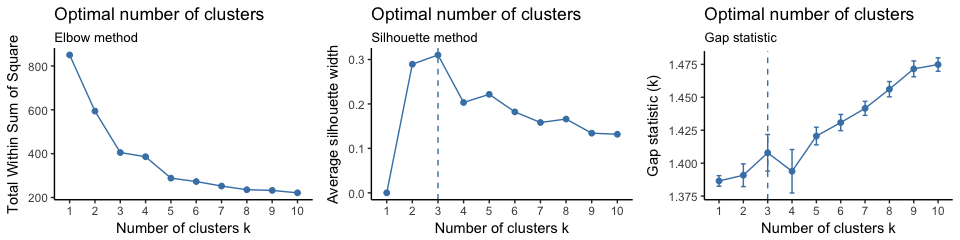
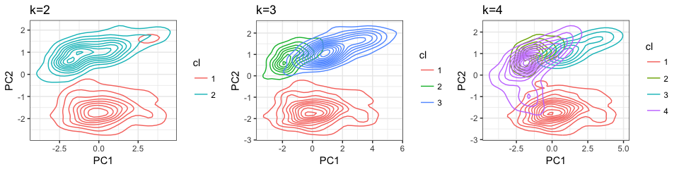
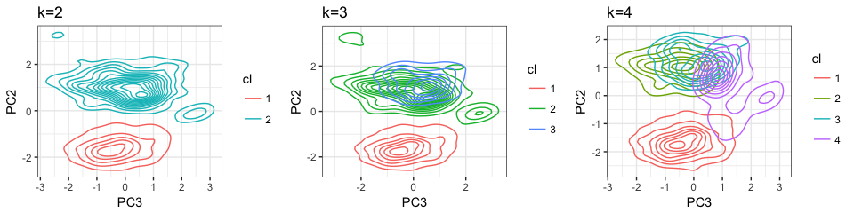
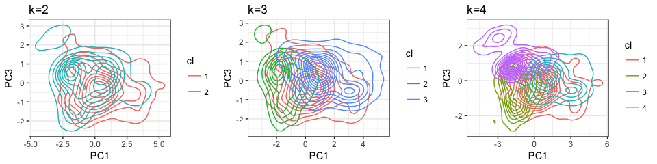

project ivy: House Prices (Kaggle) - EDA (Numerical)
================

Overview
--------

[House Prices: Advanced Regression Techniques](https://www.kaggle.com/c/house-prices-advanced-regression-techniques)

Let's get a feel for the data
-----------------------------

Let's load the data and implement the rules based on **data\_description.txt** and inspect the data

    ## Rows Cols 
    ## 2919   82

    ##        Variable Missing
    ## 1      MSZoning       4
    ## 2   LotFrontage     486
    ## 3     Utilities       2
    ## 4   Exterior1st       1
    ## 5   Exterior2nd       1
    ## 6    MasVnrType      24
    ## 7    MasVnrArea      23
    ## 8    BsmtFinSF1       1
    ## 9    BsmtFinSF2       1
    ## 10    BsmtUnfSF       1
    ## 11  TotalBsmtSF       1
    ## 12   Electrical       1
    ## 13 BsmtFullBath       2
    ## 14 BsmtHalfBath       2
    ## 15   Functional       2
    ## 16  GarageYrBlt     159
    ## 17   GarageCars       1
    ## 18   GarageArea       1
    ## 19     SaleType       1
    ## 20    SalePrice    1459

There are 21 variables containing NA's. Note the following:

-   **SalesPrice** is missing because the **test** data was merged with the **train** data. That leaves us with 20 variables containing NA's.
-   **GarageYrBlt** will be NA if there is no garage on the property

We will now impute the missing values using the k Nearest Neighbours algorithm in the package **VIM**. Imputation was done using **k**=3.

Let's visualise the missingness in the data set and also the results after imputation. 

    ##      Variable Missing
    ## 1 GarageYrBlt     159
    ## 2   SalePrice    1459

After imputation the only variables that still contains missing values are **GarageYrBlt** & **SalePrice**. As stated earlier this is to be expected. **GarageYrBlt** will be investigated further, but the missing values in **SalePrice** will be addressed once the data set is split into a **train** & **test** sets.

Visualisation
-------------

Remainder of this document will focus on numeric/integer values only. Categorical variables will be explored in another document. First we need to assess the target variable for normality.

 By inspecting the histogram and QQ-plot for **SalePrice** one can see that the variable is not normally distributed. Experience has shown that applying log10 to variables like **SalePrice** would normalise the data. This makes intuitive sense, because a $10k difference is more significant when the sale price is $30k compared to when the sale price is $1m. Compare the histogram and QQ-plot for **SalePriceLog** to confirm this.

We'll be using **SalePriceLog** from now on, because it is closer to a normal distribution.

### Numeric variables

Let's get an overview of the numeric variables 

Note the following: Some variables contain outliers. If you are going to do clustering this is imporant to note, because some algorithms are sensitive to outliers. Some variables display a double correlation pattern. This is only visible when you set the points in the plot to be transparent. (Example: TotalBsmtSF, x\_1stFlrSF)

Changing **LotArea** to **log10(LotArea)** sligthly improves the correlation with **SalePriceLog**

    ##                LotArea SalePriceLog LotAreaLog
    ## LotArea      1.0000000    0.2573199  0.6979453
    ## SalePriceLog 0.2573199    1.0000000  0.3999177
    ## LotAreaLog   0.6979453    0.3999177  1.0000000

When reading **data\_descr.txt** it is clear that some variables are highly correlated purely by definition. Let's explore those in detail and decide which to keep.

    ##              YearBuilt GarageYrBlt GarageCars GarageArea YearRemodAdd
    ## YearBuilt    1.0000000   0.8256675  0.5233495  0.4449505    0.6180581
    ## GarageYrBlt  0.8256675   1.0000000  0.5889200  0.5645671    0.6422768
    ## GarageCars   0.5233495   0.5889200  1.0000000  0.8314807    0.4506592
    ## GarageArea   0.4449505   0.5645671  0.8314807  1.0000000    0.3823228
    ## YearRemodAdd 0.6180581   0.6422768  0.4506592  0.3823228    1.0000000

From the above we can see that there is a very high correlation between **YearBuilt** & **GarageYrBlt** as well as **GarageCars** & **GarageArea**. Another point to note is that each of **GarageYrBlt**, **GarageCars** & **GarageArea** indicates the lack of a garage on the property. From here on we will only use **YearBuilt** and **GarageArea** as these variables contains info regarding the age of the property (and garage), if there is in fact a garage and its size.

### Feature engineering & PCA

During the iterative process of modelling we have engineered a few features. Some based on intuition, some on analysis and others using machine learning techniques. We discuss these now.

-   **NeighborhoodClass**: Assigned each Neighborhood to one of 10 classes (deciles of **SalePriceLog**) according to the median **SalePriceLog** of each **Neighborhood**.
-   **LotArea** = log10(**LotArea**),
-   **SalePriceLog** = log10(**SalePrice**) (as stated above)
-   **rat\_Lot\_1stFlr** = **x\_1stFlrSF** / **LotArea**
-   **rat\_garag\_land** = **GarageArea** / **LotArea**
-   **rat\_1stFlr\_GrLiv** = log10(**x\_1stFlrSF** \* **GrLivArea**)
-   **cred\_bubble** = as.factor(ifelse(**YrSold** &lt; 2008, '1', '2'))
-   **PC1**: This is the first principal component as a result of performing PCA on all numeric/integer variables. We isolated all principal components where the correlation with **SalePriceLog** is &gt;.75 and added these are feature variables.

As stated earlier there are two clusters of points that can be identified when looking at the scatterplots for **rat\_Lot\_1stFlr** & **rat\_garag\_land**. It is also interesting to note the strong linear relationship between **PC1** and **SalePrice**

#### Clustering

It would make sense that bigger houses are more expensive. As a first go at clustering this data set we take area related variables and assess the impact of area on **SalePrice**. Because we know that there are multiple outliers in the data we will use the k-medoids algorithm rather than k-means.

    ## [1] "Hopkins statistic: 0.928097"

 The Hopkins statistic suggest that the data is highly clusterable. Visual inspection is less positive with Spearman showing the most promise.

Let's cluster using PAM with the Spearman distance measure. But first, what is the optimal value of **k**?

 **k** = 3 seems to be the clear favourite, but let's explore **k** = 2,4 as well.

Doing PCA on these variable and plotting the data using PC1 (Not to be confused with the principal component **PC1** that was feature engineered) & PC2 it seems the data naturally splits into 2 clusters as was indicated earlier when we noted two clusters appearing when investigating the scatteplots of **rat\_Lot\_1stFlr** & **rat\_garag\_land** vs **SalePriceLog**.

To validate the clusters we use a silhouette plot. The silhouette plot displays a measure of how close each point in one cluster is to points in the neighboring clusters. The silhoutte is interpreted as follows:

-   A value close to 1 means the observation is well clustered
-   Values close to 0 means that the observation lies between 2 clusters
-   Observations with negative values are in the wrong cluster.

 Visual inspection certainly suggest 2 clusters, which is further confirmed by the higher average silhouette width. The fact that the silhoutte widths for **k**&gt;2 drop close the 0 so fast also indicates miss-classification of observation. We should use 2 clusters only.

    ## # A tibble: 2 x 3
    ##   cl2        mu     sd
    ##   <fct>   <dbl>  <dbl>
    ## 1 1     203199. 86973.
    ## 2 2     163870. 68472.

    ## # A tibble: 3 x 3
    ##   cl3        mu     sd
    ##   <fct>   <dbl>  <dbl>
    ## 1 1     195064. 80283.
    ## 2 2     130695. 32414.
    ## 3 3     231606. 84890.

    ## # A tibble: 4 x 3
    ##   cl4        mu     sd
    ##   <fct>   <dbl>  <dbl>
    ## 1 1     202280. 83230.
    ## 2 2     135484. 30498.
    ## 3 3     246743. 80507.
    ## 4 4     133105. 40999.

Even though **k**=2 looks like the best cluster to use, it unfortunately does not add any value in terms of discriminating **SalePriceLog** as can be seen by the density plots of **SalePriceLog** grouped by clusters. Maybe we should try hierarchical clustering?

    ## $centroid
    ## [1] 0.7105051
    ## 
    ## $ward.D2
    ## [1] 0.6861892
    ## 
    ## $single
    ## [1] 0.06590097
    ## 
    ## $average
    ## [1] 0.7234951
    ## 
    ## $complete
    ## [1] 0.5711336

The correlation coefficient shows that using the average method gave the closest fit to the original data. 

    ## # A tibble: 2 x 3
    ##   cl2        mu     sd
    ##   <fct>   <dbl>  <dbl>
    ## 1 1     197220. 85051.
    ## 2 2     169710. 73317.

    ## # A tibble: 3 x 3
    ##   cl3        mu     sd
    ##   <fct>   <dbl>  <dbl>
    ## 1 1     197220. 85051.
    ## 2 2     222115. 77314.
    ## 3 3     130723. 36990.

    ## # A tibble: 4 x 3
    ##   cl4        mu      sd
    ##   <fct>   <dbl>   <dbl>
    ## 1 1     196138.  82378.
    ## 2 2     222115.  77314.
    ## 3 3     130723.  36990.
    ## 4 4     288139. 206072.

Again, hierarchical cluster also doesn't assist in discriminating **SalePriceLog**.
