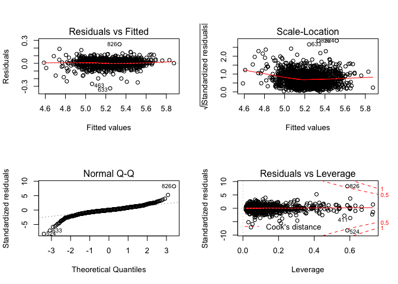
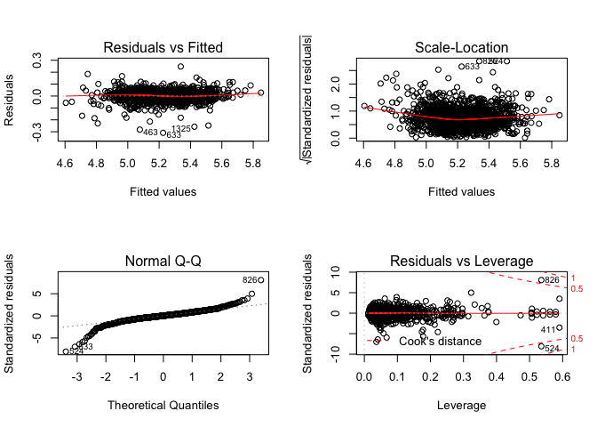
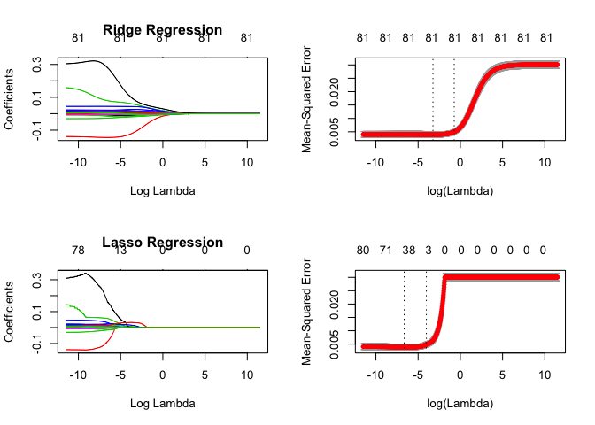
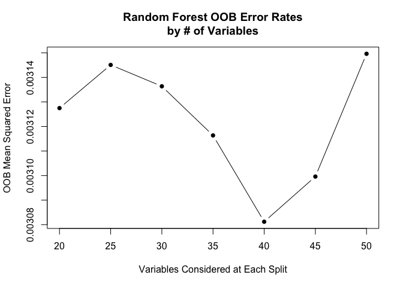
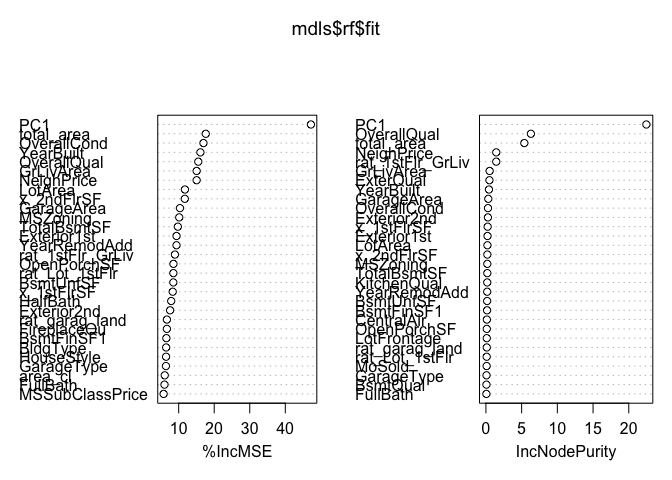

Pred
================

Multiple linear regression
==========================

-   Fit saturated model to get a benchmark
-   Variable selection using step procedure
-   Diagnostics
-   Predict and submit to Kaggle

#### Saturated model

``` r
# models list object
mdls = list(saturated = list(), step = list())

# fit saturated model
mdls$saturated$formula = formula(SalePriceLog ~ .)
mdls$saturated$fit = lm(mdls$saturated$formula, data = train)
mdls$saturated$train_error = sqrt(mean(mdls$saturated$fit$residuals^2))

# diagnostic plots 
layout(matrix(c(1,2,3,4),2,2)) # optional 4 graphs/page 
plot(mdls$saturated$fit)
```



``` r
# predictions
mdls$saturated$pred = data.frame(Id = test$Id, SalePrice = 10^predict(mdls$saturated$fit, test))

anova(mdls$saturated$fit)
```

    ## Analysis of Variance Table
    ## 
    ## Response: SalePriceLog
    ##                    Df  Sum Sq Mean Sq   F value    Pr(>F)    
    ## MSZoning            4  7.7209  1.9302  951.9297 < 2.2e-16 ***
    ## LotFrontage         1  2.6080  2.6080 1286.1727 < 2.2e-16 ***
    ## LotArea             1  1.9300  1.9300  951.8390 < 2.2e-16 ***
    ## Street              1  0.0778  0.0778   38.3709 7.904e-10 ***
    ## Alley               2  0.4076  0.2038  100.5035 < 2.2e-16 ***
    ## LotShape            3  0.9663  0.3221  158.8519 < 2.2e-16 ***
    ## LandContour         3  0.5945  0.1982   97.7312 < 2.2e-16 ***
    ## Utilities           1  0.0293  0.0293   14.4737 0.0001489 ***
    ## LotConfig           4  0.2260  0.0565   27.8580 < 2.2e-16 ***
    ## LandSlope           2  0.1294  0.0647   31.9053 3.040e-14 ***
    ## Neighborhood       24 14.8748  0.6198  305.6588 < 2.2e-16 ***
    ## Condition1          8  0.3127  0.0391   19.2763 < 2.2e-16 ***
    ## Condition2          7  0.1818  0.0260   12.8097 5.625e-16 ***
    ## BldgType            4  0.0827  0.0207   10.2013 3.953e-08 ***
    ## HouseStyle          7  0.8341  0.1192   58.7670 < 2.2e-16 ***
    ## OverallQual         1  4.7961  4.7961 2365.3104 < 2.2e-16 ***
    ## OverallCond         1  0.2879  0.2879  141.9750 < 2.2e-16 ***
    ## YearBuilt           1  0.6597  0.6597  325.3513 < 2.2e-16 ***
    ## YearRemodAdd        1  0.1439  0.1439   70.9659 < 2.2e-16 ***
    ## RoofStyle           5  0.0736  0.0147    7.2576 1.033e-06 ***
    ## RoofMatl            7  0.2653  0.0379   18.6926 < 2.2e-16 ***
    ## Exterior1st        14  0.3651  0.0261   12.8597 < 2.2e-16 ***
    ## Exterior2nd        14  0.0856  0.0061    3.0136 0.0001381 ***
    ## MasVnrType          3  0.1390  0.0463   22.8578 2.066e-14 ***
    ## MasVnrArea          1  0.0833  0.0833   41.0914 2.048e-10 ***
    ## ExterQual           1  0.0445  0.0445   21.9671 3.075e-06 ***
    ## ExterCond           1  0.0087  0.0087    4.2849 0.0386544 *  
    ## Foundation          5  0.1643  0.0329   16.2080 1.619e-15 ***
    ## BsmtQual            1  0.1081  0.1081   53.3132 5.022e-13 ***
    ## BsmtCond            1  0.0013  0.0013    0.6237 0.4298162    
    ## BsmtExposure        1  0.1162  0.1162   57.2919 7.224e-14 ***
    ## BsmtFinType1        1  0.2205  0.2205  108.7239 < 2.2e-16 ***
    ## BsmtFinSF1          1  0.3179  0.3179  156.7934 < 2.2e-16 ***
    ## BsmtFinType2        1  0.0358  0.0358   17.6469 2.847e-05 ***
    ## BsmtFinSF2          1  0.0417  0.0417   20.5788 6.268e-06 ***
    ## BsmtUnfSF           1  0.6125  0.6125  302.0469 < 2.2e-16 ***
    ## Heating             5  0.1090  0.0218   10.7555 3.830e-10 ***
    ## HeatingQC           1  0.0516  0.0516   25.4665 5.161e-07 ***
    ## CentralAir          1  0.0565  0.0565   27.8843 1.515e-07 ***
    ## Electrical          4  0.0206  0.0051    2.5389 0.0384098 *  
    ## x_1stFlrSF          1  0.4790  0.4790  236.2423 < 2.2e-16 ***
    ## x_2ndFlrSF          1  0.3817  0.3817  188.2462 < 2.2e-16 ***
    ## LowQualFinSF        1  0.0049  0.0049    2.4070 0.1210426    
    ## BsmtFullBath        1  0.0264  0.0264   12.9992 0.0003238 ***
    ## BsmtHalfBath        1  0.0009  0.0009    0.4497 0.5026008    
    ## FullBath            1  0.0001  0.0001    0.0696 0.7918908    
    ## HalfBath            1  0.0244  0.0244   12.0433 0.0005373 ***
    ## BedroomAbvGr        1  0.0032  0.0032    1.5820 0.2087109    
    ## KitchenAbvGr        1  0.0049  0.0049    2.4378 0.1186925    
    ## KitchenQual         1  0.0256  0.0256   12.6316 0.0003933 ***
    ## TotRmsAbvGrd        1  0.0069  0.0069    3.4181 0.0647203 .  
    ## Functional          6  0.1386  0.0231   11.3911 1.972e-12 ***
    ## Fireplaces          1  0.0374  0.0374   18.4646 1.864e-05 ***
    ## FireplaceQu         1  0.0055  0.0055    2.7158 0.0996083 .  
    ## GarageType          6  0.0944  0.0157    7.7616 3.241e-08 ***
    ## GarageFinish        2  0.0076  0.0038    1.8861 0.1520941    
    ## GarageArea          1  0.1010  0.1010   49.7938 2.811e-12 ***
    ## GarageQual          1  0.0131  0.0131    6.4557 0.0111789 *  
    ## GarageCond          1  0.0003  0.0003    0.1712 0.6791493    
    ## PavedDrive          2  0.0051  0.0026    1.2661 0.2822920    
    ## WoodDeckSF          1  0.0052  0.0052    2.5637 0.1095918    
    ## OpenPorchSF         1  0.0025  0.0025    1.2321 0.2672203    
    ## EnclosedPorch       1  0.0032  0.0032    1.5697 0.2104801    
    ## x_3SsnPorch         1  0.0033  0.0033    1.6169 0.2037553    
    ## ScreenPorch         1  0.0364  0.0364   17.9463 2.437e-05 ***
    ## PoolArea            1  0.0055  0.0055    2.6976 0.1007507    
    ## PoolQC              1  0.0003  0.0003    0.1283 0.7202260    
    ## Fence               1  0.0052  0.0052    2.5615 0.1097455    
    ## MiscFeature         4  0.0142  0.0036    1.7512 0.1363682    
    ## MiscVal             1  0.0000  0.0000    0.0165 0.8978456    
    ## MoSold              1  0.0000  0.0000    0.0034 0.9538399    
    ## YrSold              1  0.0023  0.0023    1.1355 0.2868091    
    ## rat_Lot_1stFlr      1  0.0478  0.0478   23.5972 1.337e-06 ***
    ## rat_garag_land      1  0.0016  0.0016    0.7897 0.3743515    
    ## cred_bubble         1  0.0001  0.0001    0.0442 0.8334571    
    ## rat_1stFlr_GrLiv    1  0.0720  0.0720   35.5174 3.276e-09 ***
    ## area_cl             1  0.0064  0.0064    3.1606 0.0756771 .  
    ## Residuals        1261  2.5569  0.0020                        
    ## ---
    ## Signif. codes:  0 '***' 0.001 '**' 0.01 '*' 0.05 '.' 0.1 ' ' 1

There are too many variables in this model to plot here instead we plot the results of the anova test. We have a look at the diagnostic plots instead and note that the Adj. R-Squared value for this model is **0.9326**.

#### Variable selection using stepwise procedure

Using a saturated model isn't practical and adds additional noise. It could also lead to over-fitting and poor generalization. We will try to reduce the number variables to only significant variables in a automated fashion. Let's choose variables by AIC in a Stepwise Algorithm.

``` r
# fit step model
require(MASS)
set.seed(2)
mdls$step$fit = step(mdls$saturated$fit,
                     direction = "both",
                     k=2,
                     trace = FALSE,
                     scope = list(lower = formula(lm(SalePriceLog ~ 1, data = train)),
                                  upper = mdls$saturated$formula))
mdls$step$formula = formula(mdls$step$fit)
mdls$step$train_error = sqrt(mean(mdls$step$fit$residuals^2))

# predictions
mdls$step$pred = data.frame(Id = test$Id, SalePrice = 10^predict(mdls$step$fit, test))
```

The stepwise model suggest using 38 of the original 78 variables. That is a reduction of 40, but are we losing any information? Use anova test to assess the impact.

``` r
# compare step vs saturated
anova(mdls$step$fit, mdls$saturated$fit)
```

    ## Analysis of Variance Table
    ## 
    ## Model 1: SalePriceLog ~ MSZoning + LotArea + Utilities + LotConfig + LandSlope + 
    ##     Neighborhood + Condition1 + Condition2 + OverallQual + OverallCond + 
    ##     YearBuilt + RoofMatl + Exterior1st + MasVnrType + ExterCond + 
    ##     Foundation + BsmtCond + BsmtExposure + BsmtFinSF1 + BsmtFinSF2 + 
    ##     BsmtUnfSF + Heating + CentralAir + x_1stFlrSF + HalfBath + 
    ##     BedroomAbvGr + KitchenAbvGr + Functional + GarageType + EnclosedPorch + 
    ##     ScreenPorch + rat_1stFlr_GrLiv + area_cl + PC1 + ExterQual + 
    ##     FireplaceQu + OpenPorchSF
    ## Model 2: SalePriceLog ~ MSZoning + LotFrontage + LotArea + Street + Alley + 
    ##     LotShape + LandContour + Utilities + LotConfig + LandSlope + 
    ##     Neighborhood + Condition1 + Condition2 + BldgType + HouseStyle + 
    ##     OverallQual + OverallCond + YearBuilt + YearRemodAdd + RoofStyle + 
    ##     RoofMatl + Exterior1st + Exterior2nd + MasVnrType + MasVnrArea + 
    ##     ExterQual + ExterCond + Foundation + BsmtQual + BsmtCond + 
    ##     BsmtExposure + BsmtFinType1 + BsmtFinSF1 + BsmtFinType2 + 
    ##     BsmtFinSF2 + BsmtUnfSF + TotalBsmtSF + Heating + HeatingQC + 
    ##     CentralAir + Electrical + x_1stFlrSF + x_2ndFlrSF + LowQualFinSF + 
    ##     GrLivArea + BsmtFullBath + BsmtHalfBath + FullBath + HalfBath + 
    ##     BedroomAbvGr + KitchenAbvGr + KitchenQual + TotRmsAbvGrd + 
    ##     Functional + Fireplaces + FireplaceQu + GarageType + GarageFinish + 
    ##     GarageArea + GarageQual + GarageCond + PavedDrive + WoodDeckSF + 
    ##     OpenPorchSF + EnclosedPorch + x_3SsnPorch + ScreenPorch + 
    ##     PoolArea + PoolQC + Fence + MiscFeature + MiscVal + MoSold + 
    ##     YrSold + NeighborhoodClass + rat_Lot_1stFlr + rat_garag_land + 
    ##     cred_bubble + rat_1stFlr_GrLiv + PC1 + area_cl
    ##   Res.Df    RSS Df Sum of Sq      F Pr(>F)
    ## 1   1340 2.7035                           
    ## 2   1261 2.5569 79   0.14655 0.9149 0.6867

The anova test indicates that we can remove these variables, without significant loss of information.

``` r
# diagnostics
summary(mdls$step$fit)
```

    ## 
    ## Call:
    ## lm(formula = SalePriceLog ~ MSZoning + LotArea + Utilities + 
    ##     LotConfig + LandSlope + Neighborhood + Condition1 + Condition2 + 
    ##     OverallQual + OverallCond + YearBuilt + RoofMatl + Exterior1st + 
    ##     MasVnrType + ExterCond + Foundation + BsmtCond + BsmtExposure + 
    ##     BsmtFinSF1 + BsmtFinSF2 + BsmtUnfSF + Heating + CentralAir + 
    ##     x_1stFlrSF + HalfBath + BedroomAbvGr + KitchenAbvGr + Functional + 
    ##     GarageType + EnclosedPorch + ScreenPorch + rat_1stFlr_GrLiv + 
    ##     area_cl + PC1 + ExterQual + FireplaceQu + OpenPorchSF, data = train)
    ## 
    ## Residuals:
    ##       Min        1Q    Median        3Q       Max 
    ## -0.308888 -0.019918  0.001132  0.023188  0.247662 
    ## 
    ## Coefficients:
    ##                       Estimate Std. Error t value Pr(>|t|)    
    ## (Intercept)          1.070e+00  3.381e-01   3.165 0.001584 ** 
    ## MSZoningFV           1.976e-01  2.184e-02   9.047  < 2e-16 ***
    ## MSZoningRH           1.913e-01  2.175e-02   8.797  < 2e-16 ***
    ## MSZoningRL           1.864e-01  1.819e-02  10.250  < 2e-16 ***
    ## MSZoningRM           1.716e-01  1.698e-02  10.110  < 2e-16 ***
    ## LotArea              8.520e-02  9.955e-03   8.559  < 2e-16 ***
    ## UtilitiesNoSeWa     -1.093e-01  4.812e-02  -2.271 0.023329 *  
    ## LotConfigCulDSac     1.141e-02  5.925e-03   1.926 0.054375 .  
    ## LotConfigFR2        -1.234e-02  7.460e-03  -1.654 0.098450 .  
    ## LotConfigFR3        -4.027e-02  2.408e-02  -1.672 0.094715 .  
    ## LotConfigInside     -3.619e-03  3.298e-03  -1.097 0.272626    
    ## LandSlopeMod         4.202e-03  6.485e-03   0.648 0.517170    
    ## LandSlopeSev        -5.345e-02  1.593e-02  -3.355 0.000817 ***
    ## NeighborhoodBlueste  2.353e-02  3.564e-02   0.660 0.509262    
    ## NeighborhoodBrDale  -7.621e-03  1.919e-02  -0.397 0.691373    
    ## NeighborhoodBrkSide  9.944e-03  1.598e-02   0.622 0.533970    
    ## NeighborhoodClearCr -9.811e-03  1.664e-02  -0.589 0.555643    
    ## NeighborhoodCollgCr -2.172e-02  1.285e-02  -1.691 0.091137 .  
    ## NeighborhoodCrawfor  3.430e-02  1.512e-02   2.269 0.023453 *  
    ## NeighborhoodEdwards -3.743e-02  1.425e-02  -2.626 0.008732 ** 
    ## NeighborhoodGilbert -1.915e-02  1.369e-02  -1.399 0.162057    
    ## NeighborhoodIDOTRR  -1.907e-02  1.849e-02  -1.031 0.302707    
    ## NeighborhoodMeadowV -4.630e-02  2.021e-02  -2.291 0.022114 *  
    ## NeighborhoodMitchel -3.293e-02  1.469e-02  -2.242 0.025095 *  
    ## NeighborhoodNAmes   -2.591e-02  1.383e-02  -1.874 0.061134 .  
    ## NeighborhoodNoRidge  3.194e-03  1.462e-02   0.218 0.827147    
    ## NeighborhoodNPkVill  3.835e-03  2.059e-02   0.186 0.852277    
    ## NeighborhoodNridgHt  2.046e-02  1.346e-02   1.520 0.128735    
    ## NeighborhoodNWAmes  -3.621e-02  1.440e-02  -2.515 0.012033 *  
    ## NeighborhoodOldTown -1.918e-02  1.650e-02  -1.163 0.245196    
    ## NeighborhoodSawyer  -1.860e-02  1.464e-02  -1.270 0.204152    
    ## NeighborhoodSawyerW -2.367e-02  1.416e-02  -1.672 0.094722 .  
    ## NeighborhoodSomerst -5.532e-04  1.644e-02  -0.034 0.973164    
    ## NeighborhoodStoneBr  3.812e-02  1.525e-02   2.499 0.012574 *  
    ## NeighborhoodSWISU   -6.109e-03  1.694e-02  -0.361 0.718392    
    ## NeighborhoodTimber  -1.195e-02  1.477e-02  -0.809 0.418745    
    ## NeighborhoodVeenker -1.098e-02  1.951e-02  -0.563 0.573661    
    ## Condition1Feedr      1.756e-02  9.145e-03   1.920 0.055081 .  
    ## Condition1Norm       3.426e-02  7.520e-03   4.556 5.68e-06 ***
    ## Condition1PosA       1.098e-02  1.851e-02   0.593 0.552959    
    ## Condition1PosN       3.801e-02  1.362e-02   2.791 0.005323 ** 
    ## Condition1RRAe      -2.580e-02  1.647e-02  -1.566 0.117632    
    ## Condition1RRAn       1.986e-02  1.262e-02   1.574 0.115754    
    ## Condition1RRNe       7.191e-03  3.369e-02   0.213 0.831020    
    ## Condition1RRNn       4.186e-02  2.339e-02   1.790 0.073741 .  
    ## Condition2Feedr      3.258e-02  4.129e-02   0.789 0.430185    
    ## Condition2Norm       1.827e-02  3.531e-02   0.517 0.605004    
    ## Condition2PosA       1.288e-01  5.888e-02   2.186 0.028952 *  
    ## Condition2PosN      -3.009e-01  5.017e-02  -5.996 2.59e-09 ***
    ## Condition2RRAe      -5.292e-02  5.840e-02  -0.906 0.365028    
    ## Condition2RRAn      -1.174e-02  5.790e-02  -0.203 0.839406    
    ## Condition2RRNn       3.661e-02  4.867e-02   0.752 0.451998    
    ## OverallQual          1.334e-02  1.956e-03   6.819 1.39e-11 ***
    ## OverallCond          1.973e-02  1.454e-03  13.571  < 2e-16 ***
    ## YearBuilt            6.366e-04  1.299e-04   4.901 1.07e-06 ***
    ## RoofMatlCompShg      9.102e-01  5.765e-02  15.789  < 2e-16 ***
    ## RoofMatlMembran      1.040e+00  7.741e-02  13.436  < 2e-16 ***
    ## RoofMatlMetal        9.856e-01  7.567e-02  13.025  < 2e-16 ***
    ## RoofMatlRoll         8.934e-01  7.435e-02  12.016  < 2e-16 ***
    ## RoofMatlTar&Grv      9.190e-01  6.007e-02  15.299  < 2e-16 ***
    ## RoofMatlWdShake      9.285e-01  6.216e-02  14.936  < 2e-16 ***
    ## RoofMatlWdShngl      9.736e-01  5.938e-02  16.397  < 2e-16 ***
    ## Exterior1stAsphShn   2.790e-03  4.860e-02   0.057 0.954229    
    ## Exterior1stBrkComm  -1.151e-01  3.676e-02  -3.132 0.001776 ** 
    ## Exterior1stBrkFace   3.790e-02  1.322e-02   2.867 0.004209 ** 
    ## Exterior1stCBlock   -2.993e-02  4.800e-02  -0.623 0.533100    
    ## Exterior1stCemntBd   1.388e-02  1.382e-02   1.005 0.315251    
    ## Exterior1stHdBoard  -4.373e-03  1.203e-02  -0.364 0.716242    
    ## Exterior1stImStucc  -3.967e-03  4.744e-02  -0.084 0.933369    
    ## Exterior1stMetalSd   1.019e-02  1.165e-02   0.875 0.381760    
    ## Exterior1stPlywood  -6.171e-03  1.257e-02  -0.491 0.623694    
    ## Exterior1stStone    -1.657e-02  3.707e-02  -0.447 0.654896    
    ## Exterior1stStucco    1.242e-02  1.466e-02   0.847 0.397283    
    ## Exterior1stVinylSd   3.176e-03  1.179e-02   0.269 0.787660    
    ## Exterior1stWd Sdng  -4.045e-03  1.161e-02  -0.348 0.727531    
    ## Exterior1stWdShing   2.221e-03  1.463e-02   0.152 0.879355    
    ## MasVnrTypeBrkFace    1.796e-02  1.277e-02   1.407 0.159795    
    ## MasVnrTypeNone       2.110e-02  1.260e-02   1.676 0.094049 .  
    ## MasVnrTypeStone      2.755e-02  1.353e-02   2.036 0.041923 *  
    ## ExterCond           -7.559e-03  3.920e-03  -1.929 0.053996 .  
    ## FoundationCBlock     1.130e-02  5.709e-03   1.979 0.047996 *  
    ## FoundationPConc      1.895e-02  6.391e-03   2.966 0.003074 ** 
    ## FoundationSlab       3.643e-02  1.587e-02   2.295 0.021884 *  
    ## FoundationStone      4.592e-02  1.972e-02   2.328 0.020056 *  
    ## FoundationWood      -4.609e-02  2.759e-02  -1.670 0.095085 .  
    ## BsmtCond            -1.044e-02  3.596e-03  -2.902 0.003770 ** 
    ## BsmtExposure         2.147e-03  1.506e-03   1.425 0.154404    
    ## BsmtFinSF1           4.120e-05  8.388e-06   4.912 1.01e-06 ***
    ## BsmtFinSF2           3.902e-05  1.076e-05   3.626 0.000298 ***
    ## BsmtUnfSF            1.732e-05  7.838e-06   2.209 0.027322 *  
    ## HeatingGasA          2.861e-02  4.763e-02   0.601 0.548112    
    ## HeatingGasW          6.765e-02  4.878e-02   1.387 0.165718    
    ## HeatingGrav         -1.341e-02  5.047e-02  -0.266 0.790452    
    ## HeatingOthW          2.464e-02  5.837e-02   0.422 0.672952    
    ## HeatingWall          3.206e-02  5.414e-02   0.592 0.553823    
    ## CentralAirY          1.815e-02  6.688e-03   2.714 0.006731 ** 
    ## x_1stFlrSF          -1.057e-04  1.484e-05  -7.121 1.74e-12 ***
    ## HalfBath             6.025e-03  3.442e-03   1.750 0.080282 .  
    ## BedroomAbvGr        -6.846e-03  2.189e-03  -3.127 0.001802 ** 
    ## KitchenAbvGr        -2.170e-02  6.964e-03  -3.116 0.001874 ** 
    ## FunctionalMaj2      -9.321e-02  2.452e-02  -3.801 0.000151 ***
    ## FunctionalMin1       1.750e-02  1.534e-02   1.141 0.254181    
    ## FunctionalMin2       1.017e-02  1.518e-02   0.670 0.502854    
    ## FunctionalMod       -2.319e-02  1.824e-02  -1.271 0.203913    
    ## FunctionalSev       -1.248e-01  5.431e-02  -2.297 0.021768 *  
    ## FunctionalTyp        3.349e-02  1.309e-02   2.558 0.010630 *  
    ## GarageTypeAttchd     5.444e-02  1.962e-02   2.775 0.005600 ** 
    ## GarageTypeBasment    5.303e-02  2.266e-02   2.340 0.019427 *  
    ## GarageTypeBuiltIn    5.815e-02  2.032e-02   2.862 0.004275 ** 
    ## GarageTypeCarPort    3.088e-02  2.609e-02   1.184 0.236801    
    ## GarageTypeDetchd     5.803e-02  1.959e-02   2.962 0.003108 ** 
    ## GarageTypeNone       7.776e-02  2.077e-02   3.745 0.000188 ***
    ## EnclosedPorch        6.571e-05  2.274e-05   2.890 0.003914 ** 
    ## ScreenPorch          7.247e-05  2.267e-05   3.197 0.001420 ** 
    ## rat_1stFlr_GrLiv     2.117e-01  2.398e-02   8.826  < 2e-16 ***
    ## area_cl2            -9.595e-03  5.047e-03  -1.901 0.057494 .  
    ## PC1                  3.148e-02  2.381e-03  13.222  < 2e-16 ***
    ## ExterQual           -1.156e-02  4.048e-03  -2.856 0.004354 ** 
    ## FireplaceQu         -2.509e-03  9.956e-04  -2.520 0.011855 *  
    ## OpenPorchSF         -3.200e-05  2.163e-05  -1.480 0.139178    
    ## ---
    ## Signif. codes:  0 '***' 0.001 '**' 0.01 '*' 0.05 '.' 0.1 ' ' 1
    ## 
    ## Residual standard error: 0.04492 on 1340 degrees of freedom
    ## Multiple R-squared:  0.9384, Adjusted R-squared:  0.933 
    ## F-statistic: 171.6 on 119 and 1340 DF,  p-value: < 2.2e-16

The **step** model attained and Adj. R-Squared value of 0.933, which is very high. It is also very similar to that of the **saturated** model. The summary indicates that there are multiple variables that are significant. What is worrying is that many of the levels in the various factor variables are not significant. Maybe additional feature engineering could be done to isolate significant levels. It is out of scope for this project.

``` r
# diagnostics
layout(matrix(c(1,2,3,4),2,2)) # optional 4 graphs/page 
plot(mdls$step$fit)
```



Residuals seem to be normally distributed for the most part. The residual plot doesn't display any patterns, but the QQ-plot does indicate that there are outliers in the data.

``` r
# diagnostics
require(car)
set.seed(0)
vif(mdls$step$fit)
```

    ##                          GVIF Df GVIF^(1/(2*Df))
    ## MSZoning            35.304259  4        1.561271
    ## LotArea              3.619433  1        1.902481
    ## Utilities            1.146813  1        1.070893
    ## LotConfig            1.742062  4        1.071847
    ## LandSlope            2.067614  2        1.199133
    ## Neighborhood     14070.870183 24        1.220178
    ## Condition1           4.567319  8        1.099585
    ## Condition2           3.045322  7        1.082792
    ## OverallQual          5.292747  1        2.300597
    ## OverallCond          1.893801  1        1.376154
    ## YearBuilt           11.131149  1        3.336338
    ## RoofMatl             5.311362  7        1.126680
    ## Exterior1st         38.916292 14        1.139700
    ## MasVnrType           3.004621  3        1.201245
    ## ExterCond            1.369146  1        1.170105
    ## Foundation          19.610926  5        1.346635
    ## BsmtCond             2.851516  1        1.688643
    ## BsmtExposure         1.869802  1        1.367407
    ## BsmtFinSF1          10.583613  1        3.253247
    ## BsmtFinSF2           2.179084  1        1.476172
    ## BsmtUnfSF            8.674591  1        2.945266
    ## Heating              2.624600  5        1.101302
    ## CentralAir           1.969168  1        1.403271
    ## x_1stFlrSF          23.810072  1        4.879557
    ## HalfBath             2.166571  1        1.471928
    ## BedroomAbvGr         2.306356  1        1.518669
    ## KitchenAbvGr         1.702778  1        1.304906
    ## Functional           3.025724  6        1.096653
    ## GarageType          10.472501  6        1.216198
    ## EnclosedPorch        1.396498  1        1.181735
    ## ScreenPorch          1.155195  1        1.074800
    ## rat_1stFlr_GrLiv    25.724819  1        5.071964
    ## area_cl              4.570355  1        2.137839
    ## PC1                 43.061536  1        6.562129
    ## ExterQual            3.907618  1        1.976770
    ## FireplaceQu          2.350477  1        1.533127
    ## OpenPorchSF          1.484978  1        1.218597

``` r
# sort(v[v > 5])
```

VIF indicates that **PC1** and **rat\_1stFlr\_GrLiv** should be removed, but the values are border-line. Let's assess the impact of removing these variables.

``` r
# compare step vs step_reduced
mdls$step_reduced$formula = update.formula(mdls$step$formula, ~ . - PC1 - rat_1stFlr_GrLiv)
mdls$step_reduced$fit = lm(mdls$step_reduced$formula, data = train)
anova(mdls$step_reduced$fit, mdls$step$fit)
```

    ## Analysis of Variance Table
    ## 
    ## Model 1: SalePriceLog ~ MSZoning + LotArea + Utilities + LotConfig + LandSlope + 
    ##     Neighborhood + Condition1 + Condition2 + OverallQual + OverallCond + 
    ##     YearBuilt + RoofMatl + Exterior1st + MasVnrType + ExterCond + 
    ##     Foundation + BsmtCond + BsmtExposure + BsmtFinSF1 + BsmtFinSF2 + 
    ##     BsmtUnfSF + Heating + CentralAir + x_1stFlrSF + HalfBath + 
    ##     BedroomAbvGr + KitchenAbvGr + Functional + GarageType + EnclosedPorch + 
    ##     ScreenPorch + area_cl + ExterQual + FireplaceQu + OpenPorchSF
    ## Model 2: SalePriceLog ~ MSZoning + LotArea + Utilities + LotConfig + LandSlope + 
    ##     Neighborhood + Condition1 + Condition2 + OverallQual + OverallCond + 
    ##     YearBuilt + RoofMatl + Exterior1st + MasVnrType + ExterCond + 
    ##     Foundation + BsmtCond + BsmtExposure + BsmtFinSF1 + BsmtFinSF2 + 
    ##     BsmtUnfSF + Heating + CentralAir + x_1stFlrSF + HalfBath + 
    ##     BedroomAbvGr + KitchenAbvGr + Functional + GarageType + EnclosedPorch + 
    ##     ScreenPorch + rat_1stFlr_GrLiv + area_cl + PC1 + ExterQual + 
    ##     FireplaceQu + OpenPorchSF
    ##   Res.Df    RSS Df Sum of Sq     F    Pr(>F)    
    ## 1   1342 3.5904                                 
    ## 2   1340 2.7035  2   0.88691 219.8 < 2.2e-16 ***
    ## ---
    ## Signif. codes:  0 '***' 0.001 '**' 0.01 '*' 0.05 '.' 0.1 ' ' 1

The anova test suggest that removal of **PC1** and **rat\_1stFlr\_GrLiv** leads to a significant different output, hence we should not remove these variables.

#### Prediction

We now predict using the **test** data and submit it to Kaggle for validation. One can see that the **step** model achieved slightly better results than the **saturated** model although we have removed 40 variables.

``` r
write_csv(mdls$saturated$pred, 'data/saturated.csv')
write_csv(mdls$step$pred, 'data/step.csv')
mdls$saturated$test_error = 0.13606
mdls$step$test_error = 0.13171

results = data.frame(
  TrainError = lapply(mdls, '[[', 'train_error') %>% unlist() %>% round(., 3),
  TestError = lapply(mdls, '[[', 'test_error') %>% unlist() %>% round(., 3))
print (results)
```

    ##           TrainError TestError
    ## saturated      0.042     0.136
    ## step           0.043     0.132

Regularization
==============

Next we will investigate **ridge** & **lasso** regression models. These algorithms are known for efficiency and accuracy.

``` r
require(glmnet)

# prep data
# ---------------
X = dplyr::select(train, -SalePriceLog) %>%
  data.matrix()
Y = dplyr::select(train, SalePriceLog) %>%
  data.matrix()
Z = dplyr::select(test, -Id) %>%
  data.matrix()
grid_r = 10^seq(5, -5, length = 1000)
grid_l = 10^seq(5, -5, length = 1000)
# i = sample(1:nrow(X), 7*nrow(X)/10)


# fit
# ---------------
set.seed(2)
mdls$ridge$fit = glmnet(x = X, y = Y, lambda = grid_r, alpha = 0)
set.seed(2)
mdls$lasso$fit = glmnet(x = X, y = Y, lambda = grid_l, alpha = 1)


# optim lambda using cross-validation
# ---------------
set.seed(2)
mdls$ridge$cv = cv.glmnet(x = X, y = Y, lambda = grid_r, alpha = 0, nfolds = 10)
set.seed(2)
mdls$lasso$cv = cv.glmnet(x = X, y = Y, lambda = grid_l, alpha = 1, nfolds = 10)

mdls$ridge$lambda = mdls$ridge$cv$lambda.min
mdls$lasso$lambda = mdls$lasso$cv$lambda.min

# error
# ---------------
mdls$ridge$train_error = sqrt(mean((predict(mdls$ridge$fit, s = mdls$ridge$lambda, newx = X) - Y)^2))
mdls$lasso$train_error = sqrt(mean((predict(mdls$lasso$fit, s = mdls$lasso$lambda, newx = X) - Y)^2))

# predict
# ---------------
mdls$ridge$pred = data.frame(Id = test$Id, SalePrice = 10^predict(mdls$ridge$fit, s = mdls$ridge$lambda, newx = Z) %>% as.vector())
mdls$lasso$pred = data.frame(Id = test$Id, SalePrice = 10^predict(mdls$lasso$fit, s = mdls$lasso$lambda, newx = Z) %>% as.vector())

# plot
# ---------------
layout(matrix(c(1,2,3,4),2,2)) # optional 4 graphs/page 
plot(mdls$ridge$fit, xvar = "lambda", label = TRUE, main = "Ridge Regression")
plot(mdls$lasso$fit, xvar = "lambda", label = TRUE, main = "Lasso Regression")
plot(mdls$ridge$cv)
plot(mdls$lasso$cv)
```



#### Prediction

We now predict using the **test** data and submit it to Kaggle for validation. The test results for the **lasso** is comparable to that of the **step** model with the added benefit of simplicity of use and processing time.

``` r
write_csv(mdls$ridge$pred, 'data/ridge.csv')
write_csv(mdls$lasso$pred, 'data/lasso.csv')
mdls$ridge$test_error = 0.13584
mdls$lasso$test_error = 0.13194

results = data.frame(
  TrainError = lapply(mdls, '[[', 'train_error') %>% unlist() %>% round(., 3),
  TestError = lapply(mdls, '[[', 'test_error') %>% unlist() %>% round(., 3))
print (results)
```

    ##           TrainError TestError
    ## saturated      0.042     0.136
    ## step           0.043     0.132
    ## ridge          0.055     0.136
    ## lasso          0.054     0.132

It would be interesting to compare the significant variables identified by both models.

``` r
# get lasso variables
lasso_vars = coef(mdls$lasso$fit)[, min(which(mdls$lasso$fit$lambda <= mdls$lasso$lambda ))]
lasso_vars = lasso_vars[lasso_vars != 0] %>% names()

# get step variables
step_vars = mdls$step$fit$coefficients %>% names()

# list variables that exists in both models
common_vars = intersect(lasso_vars, step_vars)
common_vars = common_vars[common_vars != "(Intercept)"]

cor(train[, c(common_vars, 'SalePriceLog')])
```

    ##                       LotArea OverallQual  OverallCond   YearBuilt
    ## LotArea           1.000000000  0.17821541 -0.006305335  0.02193668
    ## OverallQual       0.178215412  1.00000000 -0.091932343  0.57232277
    ## OverallCond      -0.006305335 -0.09193234  1.000000000 -0.37598320
    ## YearBuilt         0.021936683  0.57232277 -0.375983196  1.00000000
    ## BsmtExposure      0.212133567  0.29651684 -0.056731502  0.28962289
    ## BsmtUnfSF         0.077247017  0.30815893 -0.136840570  0.14904039
    ## x_1stFlrSF        0.443869124  0.47622383 -0.144202784  0.28198586
    ## HalfBath          0.038716831  0.27345810 -0.060769327  0.24265591
    ## KitchenAbvGr      0.001678003 -0.18388223 -0.087000855 -0.17480025
    ## FireplaceQu       0.275546968  0.49078782 -0.056898768  0.22454514
    ## EnclosedPorch     0.010951494 -0.11393686  0.070356184 -0.38726778
    ## ScreenPorch       0.097381019  0.06488636  0.054810529 -0.05036443
    ## rat_1stFlr_GrLiv  0.483868328  0.61077991 -0.135276643  0.29113572
    ## PC1               0.406639435  0.81815643 -0.173334659  0.62319942
    ## SalePriceLog      0.399917741  0.81718442 -0.036867988  0.58657024
    ##                  BsmtExposure    BsmtUnfSF  x_1stFlrSF    HalfBath
    ## LotArea            0.21213357  0.077247017  0.44386912  0.03871683
    ## OverallQual        0.29651684  0.308158927  0.47622383  0.27345810
    ## OverallCond       -0.05673150 -0.136840570 -0.14420278 -0.06076933
    ## YearBuilt          0.28962289  0.149040392  0.28198586  0.24265591
    ## BsmtExposure       1.00000000 -0.035012540  0.30485635 -0.03479076
    ## BsmtUnfSF         -0.03501254  1.000000000  0.31798744 -0.04111753
    ## x_1stFlrSF         0.30485635  0.317987438  1.00000000 -0.11991591
    ## HalfBath          -0.03479076 -0.041117530 -0.11991591  1.00000000
    ## KitchenAbvGr      -0.12196062  0.030085868  0.06810059 -0.06826255
    ## FireplaceQu        0.16690234  0.158785724  0.40788744  0.20218412
    ## EnclosedPorch     -0.09453207 -0.002537855 -0.06529170 -0.09531653
    ## ScreenPorch        0.04220682 -0.012579273  0.08875807  0.07242585
    ## rat_1stFlr_GrLiv   0.22535742  0.333129229  0.85960847  0.17436717
    ## PC1                0.39818059  0.288443530  0.73894243  0.26381133
    ## SalePriceLog       0.35742110  0.221985054  0.59698105  0.31398225
    ##                  KitchenAbvGr FireplaceQu EnclosedPorch ScreenPorch
    ## LotArea           0.001678003  0.27554697   0.010951494  0.09738102
    ## OverallQual      -0.183882235  0.49078782  -0.113936859  0.06488636
    ## OverallCond      -0.087000855 -0.05689877   0.070356184  0.05481053
    ## YearBuilt        -0.174800246  0.22454514  -0.387267783 -0.05036443
    ## BsmtExposure     -0.121960617  0.16690234  -0.094532070  0.04220682
    ## BsmtUnfSF         0.030085868  0.15878572  -0.002537855 -0.01257927
    ## x_1stFlrSF        0.068100588  0.40788744  -0.065291701  0.08875807
    ## HalfBath         -0.068262549  0.20218412  -0.095316526  0.07242585
    ## KitchenAbvGr      1.000000000 -0.15481143   0.037312385 -0.05161337
    ## FireplaceQu      -0.154811428  1.00000000  -0.042696669  0.15000204
    ## EnclosedPorch     0.037312385 -0.04269667   1.000000000 -0.08286424
    ## ScreenPorch      -0.051613366  0.15000204  -0.082864245  1.00000000
    ## rat_1stFlr_GrLiv  0.104772877  0.51331303  -0.037652278  0.11843934
    ## PC1              -0.107339256  0.57806833  -0.175086676  0.09737081
    ## SalePriceLog     -0.147548088  0.54636198  -0.149050281  0.12120760
    ##                  rat_1stFlr_GrLiv         PC1 SalePriceLog
    ## LotArea                0.48386833  0.40663944   0.39991774
    ## OverallQual            0.61077991  0.81815643   0.81718442
    ## OverallCond           -0.13527664 -0.17333466  -0.03686799
    ## YearBuilt              0.29113572  0.62319942   0.58657024
    ## BsmtExposure           0.22535742  0.39818059   0.35742110
    ## BsmtUnfSF              0.33312923  0.28844353   0.22198505
    ## x_1stFlrSF             0.85960847  0.73894243   0.59698105
    ## HalfBath               0.17436717  0.26381133   0.31398225
    ## KitchenAbvGr           0.10477288 -0.10733926  -0.14754809
    ## FireplaceQu            0.51331303  0.57806833   0.54636198
    ## EnclosedPorch         -0.03765228 -0.17508668  -0.14905028
    ## ScreenPorch            0.11843934  0.09737081   0.12120760
    ## rat_1stFlr_GrLiv       1.00000000  0.83897405   0.76321234
    ## PC1                    0.83897405  1.00000000   0.90826019
    ## SalePriceLog           0.76321234  0.90826019   1.00000000

``` r
require(ggplot2)
require(GGally)
ggcorr(train[, c(common_vars, 'SalePriceLog')], nbreaks = 4, palette = "RdGy", label = TRUE, label_size = 3, label_color = "white")
```


RandomForest
============

The process:

-   Find the best value for **mtry**
-   Fit the model using best **mtry**
-   Check variable importance
-   Refit using only the best variable and assess performance
-   Predict and submit to Kaggle

``` r
require(randomForest)

optim = TRUE
if(optim){
  grid = seq(20,50,5)
  oob.err = numeric(length(grid))
  for (idx in 1:length(grid)) {
    mtry = grid[idx]
    fit = randomForest(SalePriceLog ~ ., data = train, mtry = mtry)
    oob.err[idx] = fit$mse[500]
    cat("We're performing iteration", mtry, "\n")
  }
  
  #Visualizing the OOB error.
  plot(grid, oob.err, pch = 16, type = "b",
       xlab = "Variables Considered at Each Split",
       ylab = "OOB Mean Squared Error",
       main = "Random Forest OOB Error Rates\nby # of Variables")
  
  best_mtry = grid[which.min(oob.err)]
} else {
  best_mtry = 40
}
```

    ## We're performing iteration 20 
    ## We're performing iteration 25 
    ## We're performing iteration 30 
    ## We're performing iteration 35 
    ## We're performing iteration 40 
    ## We're performing iteration 45 
    ## We're performing iteration 50



From the plot one can see that the optimal value of **mtry** is 35.

``` r
#Fitting an  random forest model to the train data using the best mtry
set.seed(0)
mdls$rf$best_mtry = best_mtry  
mdls$rf$formula = formula(SalePriceLog ~ .)
mdls$rf$fit = randomForest(mdls$rf$formula, data = train, importance = TRUE, mtry = mdls$rf$best_mtry)
mdls$rf$train_error = sqrt(mean((train$SalePriceLog - predict(mdls$rf$fit, train))^2))

# Predict
mdls$rf$pred = data.frame(Id = test$Id, SalePrice = 10^predict(mdls$rf$fit, test))
```

``` r
varImp = importance(mdls$rf$fit) %>% as.data.frame()
varImpPlot(mdls$rf$fit)
```



Use only top n variables where %IncMSE &gt; 10 and fit a reduced randomForest model.

``` r
rf_vars = rownames(varImp[varImp$`%IncMSE` > 10,])
mdls$rf_reduced$formula = paste('SalePriceLog ~ ', paste(rf_vars, collapse = ' + ')) %>% as.formula(.)
mdls$rf_reduced$fit = randomForest(mdls$rf_reduced$formula, data = train, importance = TRUE)
mdls$rf_reduced$train_error = sqrt(mean((train$SalePriceLog - predict(mdls$rf_reduced$fit, train))^2))

# Predict
mdls$rf_reduced$pred = data.frame(Id = test$Id, SalePrice = 10^predict(mdls$rf_reduced$fit, test))
```

### Prediction

We now predict using the **test** data and submit it to Kaggle for validation. The test results for both random forest models are worse than the regression models, but note that the training error is much better. This speaks to overfitting of the random forest models which leads to poor generalization.

``` r
write_csv(mdls$rf$pred, 'data/rf.csv')
write_csv(mdls$rf_reduced$pred, 'data/rf_reduced.csv')
mdls$rf$test_error = 0.14355
mdls$rf_reduced$test_error = 0.14551

results = data.frame(
  TrainError = lapply(mdls, '[[', 'train_error') %>% unlist() %>% round(., 3),
  TestError = lapply(mdls, '[[', 'test_error') %>% unlist() %>% round(., 3))
print (results)
```

    ##            TrainError TestError
    ## saturated       0.042     0.136
    ## step            0.043     0.132
    ## ridge           0.055     0.136
    ## lasso           0.054     0.132
    ## rf              0.023     0.144
    ## rf_reduced      0.025     0.146
