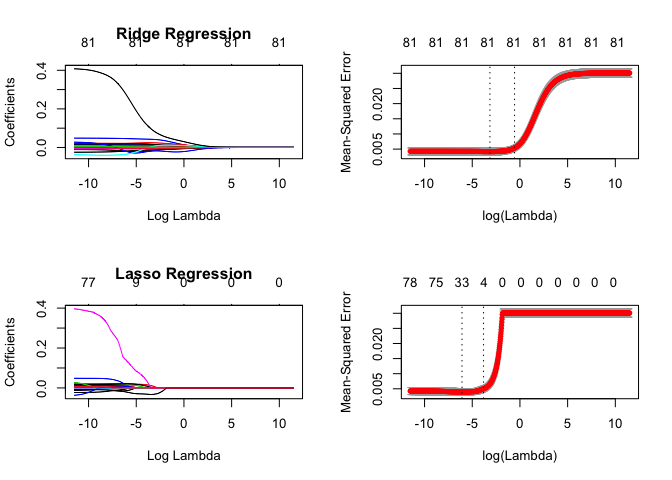

Pred
================

Multiple linear regression
==========================

-   Fit saturated model to get a benchmark
-   Fit intuitive model
-   Variable selection using step procedure
-   Diagnostics
-   Predict and submit to Kaggle

#### Saturated model

To start we are going to fit a model with all available variables. This model will serve as the benchmark.

``` r
# models list object
mdls = list(saturated = list(), intuition = list(), step = list())

# fit saturated model
mdls$saturated$formula = formula(SalePriceLog ~ .)
mdls$saturated$fit = lm(mdls$saturated$formula, data = train)
mdls$saturated$train_error = sqrt(mean(mdls$saturated$fit$residuals^2))

# predictions
mdls$saturated$pred = data.frame(Id = test$Id, SalePrice = 10^predict(mdls$saturated$fit, test))


# diagnostic plots 
layout(matrix(c(1,2,3,4),2,2)) # optional 4 graphs/page 
plot(mdls$saturated$fit)
```


``` r
anova(mdls$saturated$fit)
```

    ## Analysis of Variance Table
    ## 
    ## Response: SalePriceLog
    ##                    Df  Sum Sq Mean Sq   F value    Pr(>F)    
    ## MSZoning            4  7.7209  1.9302  871.4548 < 2.2e-16 ***
    ## LotFrontage         1  2.7558  2.7558 1244.1897 < 2.2e-16 ***
    ## LotArea             1  0.8922  0.8922  402.8194 < 2.2e-16 ***
    ## Street              1  0.0934  0.0934   42.1879 1.181e-10 ***
    ## Alley               2  0.2485  0.1242   56.0935 < 2.2e-16 ***
    ## LotShape            1  0.8951  0.8951  404.1371 < 2.2e-16 ***
    ## LandContour         3  0.6261  0.2087   94.2178 < 2.2e-16 ***
    ## LotConfig           4  0.3163  0.0791   35.7062 < 2.2e-16 ***
    ## LandSlope           1  0.0434  0.0434   19.5730 1.050e-05 ***
    ## Condition1          8  0.9227  0.1153   52.0701 < 2.2e-16 ***
    ## Condition2          7  0.2843  0.0406   18.3371 < 2.2e-16 ***
    ## BldgType            4  1.0943  0.2736  123.5172 < 2.2e-16 ***
    ## HouseStyle          7  2.3855  0.3408  153.8552 < 2.2e-16 ***
    ## OverallQual         1 15.1695 15.1695 6848.7275 < 2.2e-16 ***
    ## OverallCond         1  0.1481  0.1481   66.8688 6.877e-16 ***
    ## YearBuilt           1  0.8152  0.8152  368.0652 < 2.2e-16 ***
    ## YearRemodAdd        1  0.1462  0.1462   66.0267 1.032e-15 ***
    ## RoofStyle           5  0.1382  0.0276   12.4778 7.560e-12 ***
    ## RoofMatl            7  0.4913  0.0702   31.6880 < 2.2e-16 ***
    ## Exterior1st        14  0.4707  0.0336   15.1808 < 2.2e-16 ***
    ## Exterior2nd        14  0.1051  0.0075    3.3891 2.064e-05 ***
    ## MasVnrType          3  0.2741  0.0914   41.2444 < 2.2e-16 ***
    ## MasVnrArea          1  0.2437  0.2437  110.0390 < 2.2e-16 ***
    ## ExterQual           1  0.1582  0.1582   71.4038 < 2.2e-16 ***
    ## ExterCond           1  0.0214  0.0214    9.6646  0.001920 ** 
    ## Foundation          5  0.1800  0.0360   16.2549 1.420e-15 ***
    ## BsmtQual            1  0.1949  0.1949   88.0016 < 2.2e-16 ***
    ## BsmtCond            1  0.0001  0.0001    0.0257  0.872719    
    ## BsmtExposure        1  0.1604  0.1604   72.4376 < 2.2e-16 ***
    ## BsmtFinType1        1  0.2183  0.2183   98.5616 < 2.2e-16 ***
    ## BsmtFinSF1          1  0.4502  0.4502  203.2468 < 2.2e-16 ***
    ## BsmtFinType2        1  0.0370  0.0370   16.7062 4.633e-05 ***
    ## BsmtFinSF2          1  0.0513  0.0513   23.1480 1.677e-06 ***
    ## BsmtUnfSF           1  0.8809  0.8809  397.7176 < 2.2e-16 ***
    ## Heating             5  0.0873  0.0175    7.8818 2.529e-07 ***
    ## HeatingQC           1  0.0361  0.0361   16.3109 5.692e-05 ***
    ## CentralAir          1  0.0744  0.0744   33.5980 8.509e-09 ***
    ## Electrical          4  0.0181  0.0045    2.0386  0.086754 .  
    ## x_1stFlrSF          1  0.7094  0.7094  320.2574 < 2.2e-16 ***
    ## x_2ndFlrSF          1  0.4534  0.4534  204.6920 < 2.2e-16 ***
    ## LowQualFinSF        1  0.0083  0.0083    3.7540  0.052899 .  
    ## BsmtFullBath        1  0.0187  0.0187    8.4342  0.003745 ** 
    ## BsmtHalfBath        1  0.0001  0.0001    0.0632  0.801581    
    ## FullBath            1  0.0000  0.0000    0.0176  0.894397    
    ## HalfBath            1  0.0236  0.0236   10.6748  0.001115 ** 
    ## BedroomAbvGr        1  0.0180  0.0180    8.1270  0.004430 ** 
    ## KitchenAbvGr        1  0.0129  0.0129    5.8274  0.015917 *  
    ## KitchenQual         1  0.0373  0.0373   16.8609 4.275e-05 ***
    ## TotRmsAbvGrd        1  0.0192  0.0192    8.6688  0.003295 ** 
    ## Functional          1  0.1221  0.1221   55.1315 2.041e-13 ***
    ## Fireplaces          1  0.0681  0.0681   30.7268 3.598e-08 ***
    ## FireplaceQu         1  0.0166  0.0166    7.4984  0.006260 ** 
    ## GarageType          6  0.1433  0.0239   10.7820 9.956e-12 ***
    ## GarageFinish        1  0.0014  0.0014    0.6230  0.430084    
    ## GarageArea          1  0.1309  0.1309   59.0833 2.980e-14 ***
    ## GarageQual          1  0.0067  0.0067    3.0193  0.082519 .  
    ## GarageCond          1  0.0005  0.0005    0.2124  0.644988    
    ## PavedDrive          1  0.0028  0.0028    1.2575  0.262343    
    ## WoodDeckSF          1  0.0061  0.0061    2.7648  0.096604 .  
    ## OpenPorchSF         1  0.0015  0.0015    0.6601  0.416661    
    ## EnclosedPorch       1  0.0049  0.0049    2.2299  0.135606    
    ## x_3SsnPorch         1  0.0044  0.0044    1.9645  0.161269    
    ## ScreenPorch         1  0.0376  0.0376   16.9589 4.063e-05 ***
    ## PoolArea            1  0.0014  0.0014    0.6499  0.420281    
    ## PoolQC              1  0.0021  0.0021    0.9642  0.326308    
    ## Fence               1  0.0068  0.0068    3.0659  0.080189 .  
    ## MiscFeature         4  0.0199  0.0050    2.2459  0.062123 .  
    ## MiscVal             1  0.0000  0.0000    0.0045  0.946657    
    ## MoSold              1  0.0006  0.0006    0.2525  0.615372    
    ## YrSold              1  0.0054  0.0054    2.4357  0.118849    
    ## NeighPrice          4  0.1593  0.0398   17.9853 2.204e-14 ***
    ## MSSubClassPrice     1  0.0142  0.0142    6.3970  0.011550 *  
    ## rat_Lot_1stFlr      1  0.0096  0.0096    4.3213  0.037835 *  
    ## rat_garag_land      1  0.0004  0.0004    0.1599  0.689351    
    ## cred_bubble         1  0.0002  0.0002    0.1119  0.738096    
    ## rat_1stFlr_GrLiv    1  0.1301  0.1301   58.7466 3.509e-14 ***
    ## area_cl             2  0.0045  0.0023    1.0202  0.360821    
    ## Residuals        1290  2.8573  0.0022                        
    ## ---
    ## Signif. codes:  0 '***' 0.001 '**' 0.01 '*' 0.05 '.' 0.1 ' ' 1

There are too many variables in this model to plot here instead we plot the results of the anova test. We have a look at the diagnostic plots, anova results and note that the Adj. R-Squared value for this model is **0.9264021**.

#### Intuitive model

The **intuitive** model is built on variables that seems to make intuitive sense.

``` r
# fit intuition model
mdls$intuition$formula = formula(SalePriceLog ~ TotalBsmtSF + NeighPrice + OverallQual + OverallCond + YearBuilt + GrLivArea + BsmtQual + KitchenQual + HeatingQC + FireplaceQu + GarageArea + CentralAir + LotArea + LotShape + BsmtFinSF1 + x_1stFlrSF)
mdls$intuition$fit = lm(mdls$intuition$formula, data = train)
mdls$intuition$train_error = sqrt(mean(mdls$intuition$fit$residuals^2))

# predictions
mdls$intuition$pred = data.frame(Id = test$Id, SalePrice = 10^predict(mdls$intuition$fit, test))

# diagnostic plots 
layout(matrix(c(1,2,3,4),2,2)) # optional 4 graphs/page 
plot(mdls$intuition$fit)
```


``` r
anova(mdls$intuition$fit)
```

    ## Analysis of Variance Table
    ## 
    ## Response: SalePriceLog
    ##               Df  Sum Sq Mean Sq   F value    Pr(>F)    
    ## TotalBsmtSF    1 16.4530 16.4530 4275.9365 < 2.2e-16 ***
    ## NeighPrice     4 11.7166  2.9291  761.2473 < 2.2e-16 ***
    ## OverallQual    1  5.2976  5.2976 1376.7719 < 2.2e-16 ***
    ## OverallCond    1  0.5781  0.5781  150.2373 < 2.2e-16 ***
    ## YearBuilt      1  0.0975  0.0975   25.3449 5.399e-07 ***
    ## GrLivArea      1  3.0019  3.0019  780.1651 < 2.2e-16 ***
    ## BsmtQual       1  0.0344  0.0344    8.9504 0.0028212 ** 
    ## KitchenQual    1  0.1659  0.1659   43.1260 7.148e-11 ***
    ## HeatingQC      1  0.0466  0.0466   12.1131 0.0005156 ***
    ## FireplaceQu    1  0.2482  0.2482   64.5047 1.985e-15 ***
    ## GarageArea     1  0.3482  0.3482   90.4981 < 2.2e-16 ***
    ## CentralAir     1  0.0671  0.0671   17.4263 3.166e-05 ***
    ## LotArea        1  0.1572  0.1572   40.8471 2.218e-10 ***
    ## LotShape       1  0.0006  0.0006    0.1558 0.6931549    
    ## BsmtFinSF1     1  0.1160  0.1160   30.1439 4.735e-08 ***
    ## x_1stFlrSF     1  0.0391  0.0391   10.1726 0.0014561 ** 
    ## Residuals   1440  5.5409  0.0038                        
    ## ---
    ## Signif. codes:  0 '***' 0.001 '**' 0.01 '*' 0.05 '.' 0.1 ' ' 1

We have a look at the diagnostic plots and note that the Adj. R-Squared value for this model is **0.8721452**.

#### Variable selection using stepwise procedure

Using a saturated model isn't practical and adds additional noise. It could also lead to over-fitting and poor generalization. We will try to reduce the number variables to only significant variables in a automated fashion. Let's choose variables by AIC in a Stepwise Algorithm.

``` r
# fit step model
require(MASS)
set.seed(2)
mdls$step$fit = step(mdls$saturated$fit,
                     direction = "both",
                     k=2,
                     trace = FALSE,
                     scope = list(lower = formula(lm(SalePriceLog ~ 1, data = train)),
                                  upper = mdls$saturated$formula))
mdls$step$formula = formula(mdls$step$fit)
mdls$step$train_error = sqrt(mean(mdls$step$fit$residuals^2))

# predictions
mdls$step$pred = data.frame(Id = test$Id, SalePrice = 10^predict(mdls$step$fit, test))

# diagnostic plots 
layout(matrix(c(1,2,3,4),2,2)) # optional 4 graphs/page 
plot(mdls$step$fit)
```


``` r
anova(mdls$step$fit)
```

    ## Analysis of Variance Table
    ## 
    ## Response: SalePriceLog
    ##                    Df  Sum Sq Mean Sq   F value    Pr(>F)    
    ## MSZoning            4  7.7209  1.9302  884.5560 < 2.2e-16 ***
    ## LotArea             1  1.8115  1.8115  830.1506 < 2.2e-16 ***
    ## LandContour         3  0.7569  0.2523  115.6165 < 2.2e-16 ***
    ## LotConfig           4  0.2779  0.0695   31.8361 < 2.2e-16 ***
    ## Condition1          8  0.9832  0.1229   56.3231 < 2.2e-16 ***
    ## Condition2          7  0.3110  0.0444   20.3604 < 2.2e-16 ***
    ## BldgType            4  0.7959  0.1990   91.1792 < 2.2e-16 ***
    ## OverallQual         1 20.2640 20.2640 9286.3171 < 2.2e-16 ***
    ## OverallCond         1  0.1174  0.1174   53.8220 3.761e-13 ***
    ## YearBuilt           1  0.7528  0.7528  345.0006 < 2.2e-16 ***
    ## RoofMatl            7  0.2996  0.0428   19.6166 < 2.2e-16 ***
    ## Exterior1st        14  0.4066  0.0290   13.3088 < 2.2e-16 ***
    ## MasVnrType          3  0.2341  0.0780   35.7531 < 2.2e-16 ***
    ## ExterCond           1  0.0171  0.0171    7.8245 0.0052269 ** 
    ## Foundation          5  0.2819  0.0564   25.8337 < 2.2e-16 ***
    ## BsmtExposure        1  0.1059  0.1059   48.5155 5.090e-12 ***
    ## BsmtFinSF1          1  0.7144  0.7144  327.3932 < 2.2e-16 ***
    ## BsmtFinSF2          1  0.0769  0.0769   35.2547 3.668e-09 ***
    ## Heating             5  0.1534  0.0307   14.0573 2.000e-13 ***
    ## x_1stFlrSF          1  0.9227  0.9227  422.8515 < 2.2e-16 ***
    ## BedroomAbvGr        1  0.6104  0.6104  279.7418 < 2.2e-16 ***
    ## KitchenAbvGr        1  0.0086  0.0086    3.9596 0.0468049 *  
    ## Functional          1  0.0309  0.0309   14.1455 0.0001764 ***
    ## GarageType          6  0.3741  0.0624   28.5757 < 2.2e-16 ***
    ## GarageArea          1  0.4152  0.4152  190.2678 < 2.2e-16 ***
    ## EnclosedPorch       1  0.0051  0.0051    2.3271 0.1273674    
    ## ScreenPorch         1  0.0893  0.0893   40.9076 2.190e-10 ***
    ## YrSold              1  0.0084  0.0084    3.8349 0.0504007 .  
    ## NeighPrice          4  0.4615  0.1154   52.8697 < 2.2e-16 ***
    ## rat_1stFlr_GrLiv    1  1.4918  1.4918  683.6476 < 2.2e-16 ***
    ## PC1                 1  0.3881  0.3881  177.8575 < 2.2e-16 ***
    ## LotShape            1  0.0140  0.0140    6.4201 0.0113949 *  
    ## PavedDrive          1  0.0069  0.0069    3.1848 0.0745509 .  
    ## ExterQual           1  0.0053  0.0053    2.4171 0.1202520    
    ## BsmtCond            1  0.0067  0.0067    3.0618 0.0803763 .  
    ## MSSubClassPrice     1  0.0064  0.0064    2.9307 0.0871400 .  
    ## GarageFinish        1  0.0065  0.0065    2.9653 0.0852953 .  
    ## OpenPorchSF         1  0.0046  0.0046    2.0975 0.1477703    
    ## FireplaceQu         1  0.0056  0.0056    2.5473 0.1107125    
    ## Residuals        1359  2.9655  0.0022                        
    ## ---
    ## Signif. codes:  0 '***' 0.001 '**' 0.01 '*' 0.05 '.' 0.1 ' ' 1

The residual plot doesn't display any patterns like fanning, but the QQ-plot does indicate an element of non-normality. This indicates that the errors are not random and that the model does **not** fully explain all the variance.

The stepwise model suggest using 40 of the original 78 variables. That is a reduction of 38, but are we losing any information? Use anova test to assess the impact.

``` r
# compare step vs saturated
anova(mdls$step$fit, mdls$saturated$fit)
```

    ## Analysis of Variance Table
    ## 
    ## Model 1: SalePriceLog ~ MSZoning + LotArea + LandContour + LotConfig + 
    ##     Condition1 + Condition2 + BldgType + OverallQual + OverallCond + 
    ##     YearBuilt + RoofMatl + Exterior1st + MasVnrType + ExterCond + 
    ##     Foundation + BsmtExposure + BsmtFinSF1 + BsmtFinSF2 + Heating + 
    ##     x_1stFlrSF + BedroomAbvGr + KitchenAbvGr + Functional + GarageType + 
    ##     GarageArea + EnclosedPorch + ScreenPorch + YrSold + NeighPrice + 
    ##     rat_1stFlr_GrLiv + PC1 + LotShape + PavedDrive + ExterQual + 
    ##     BsmtCond + MSSubClassPrice + GarageFinish + OpenPorchSF + 
    ##     FireplaceQu
    ## Model 2: SalePriceLog ~ MSZoning + LotFrontage + LotArea + Street + Alley + 
    ##     LotShape + LandContour + LotConfig + LandSlope + Condition1 + 
    ##     Condition2 + BldgType + HouseStyle + OverallQual + OverallCond + 
    ##     YearBuilt + YearRemodAdd + RoofStyle + RoofMatl + Exterior1st + 
    ##     Exterior2nd + MasVnrType + MasVnrArea + ExterQual + ExterCond + 
    ##     Foundation + BsmtQual + BsmtCond + BsmtExposure + BsmtFinType1 + 
    ##     BsmtFinSF1 + BsmtFinType2 + BsmtFinSF2 + BsmtUnfSF + TotalBsmtSF + 
    ##     Heating + HeatingQC + CentralAir + Electrical + x_1stFlrSF + 
    ##     x_2ndFlrSF + LowQualFinSF + GrLivArea + BsmtFullBath + BsmtHalfBath + 
    ##     FullBath + HalfBath + BedroomAbvGr + KitchenAbvGr + KitchenQual + 
    ##     TotRmsAbvGrd + Functional + Fireplaces + FireplaceQu + GarageType + 
    ##     GarageFinish + GarageArea + GarageQual + GarageCond + PavedDrive + 
    ##     WoodDeckSF + OpenPorchSF + EnclosedPorch + x_3SsnPorch + 
    ##     ScreenPorch + PoolArea + PoolQC + Fence + MiscFeature + MiscVal + 
    ##     MoSold + YrSold + NeighPrice + MSSubClassPrice + total_area + 
    ##     rat_Lot_1stFlr + rat_garag_land + cred_bubble + rat_1stFlr_GrLiv + 
    ##     PC1 + area_cl
    ##   Res.Df    RSS Df Sum of Sq      F Pr(>F)
    ## 1   1359 2.9655                           
    ## 2   1290 2.8573 69   0.10825 0.7083 0.9658

The anova test indicates that we can remove these variables, without significant loss of information. The **step** model attained and Adj. R-Squared value of 0.9274922, which is very high. It is also very similar to that of the **saturated** model. The summary indicates that there are multiple variables that are significant. What is worrying is that many of the levels in the various factor variables are not significant. Maybe additional feature engineering could be done to isolate significant levels. It is out of scope for this project.

``` r
# compare step vs intuition
anova(mdls$step$fit, mdls$intuition$fit)
```

    ## Analysis of Variance Table
    ## 
    ## Model 1: SalePriceLog ~ MSZoning + LotArea + LandContour + LotConfig + 
    ##     Condition1 + Condition2 + BldgType + OverallQual + OverallCond + 
    ##     YearBuilt + RoofMatl + Exterior1st + MasVnrType + ExterCond + 
    ##     Foundation + BsmtExposure + BsmtFinSF1 + BsmtFinSF2 + Heating + 
    ##     x_1stFlrSF + BedroomAbvGr + KitchenAbvGr + Functional + GarageType + 
    ##     GarageArea + EnclosedPorch + ScreenPorch + YrSold + NeighPrice + 
    ##     rat_1stFlr_GrLiv + PC1 + LotShape + PavedDrive + ExterQual + 
    ##     BsmtCond + MSSubClassPrice + GarageFinish + OpenPorchSF + 
    ##     FireplaceQu
    ## Model 2: SalePriceLog ~ TotalBsmtSF + NeighPrice + OverallQual + OverallCond + 
    ##     YearBuilt + GrLivArea + BsmtQual + KitchenQual + HeatingQC + 
    ##     FireplaceQu + GarageArea + CentralAir + LotArea + LotShape + 
    ##     BsmtFinSF1 + x_1stFlrSF
    ##   Res.Df    RSS  Df Sum of Sq     F    Pr(>F)    
    ## 1   1359 2.9655                                  
    ## 2   1440 5.5409 -81   -2.5753 14.57 < 2.2e-16 ***
    ## ---
    ## Signif. codes:  0 '***' 0.001 '**' 0.01 '*' 0.05 '.' 0.1 ' ' 1

It is interesting to note that there is a significant difference between the **step** & **intuition** models, but both still have an Adj. R-Squared value of greater than 0.8.

``` r
# diagnostics
require(car)
set.seed(0)
vif(mdls$step$fit)
```

    ##                       GVIF Df GVIF^(1/(2*Df))
    ## MSZoning          4.207331  4        1.196743
    ## LotArea           1.741418  1        1.319628
    ## LandContour       1.942159  3        1.116985
    ## LotConfig         1.732371  4        1.071100
    ## Condition1        3.229723  8        1.076026
    ## Condition2        3.044961  7        1.082783
    ## BldgType          9.285707  4        1.321225
    ## OverallQual       5.054402  1        2.248200
    ## OverallCond       1.740707  1        1.319359
    ## YearBuilt        10.141779  1        3.184616
    ## RoofMatl          3.435449  7        1.092156
    ## Exterior1st      15.951859 14        1.103971
    ## MasVnrType        2.231356  3        1.143128
    ## ExterCond         1.330864  1        1.153631
    ## Foundation       15.735038  5        1.317306
    ## BsmtExposure      1.804157  1        1.343189
    ## BsmtFinSF1        2.216620  1        1.488832
    ## BsmtFinSF2        1.254069  1        1.119852
    ## Heating           2.135460  5        1.078820
    ## x_1stFlrSF        8.358646  1        2.891132
    ## BedroomAbvGr      2.398148  1        1.548596
    ## KitchenAbvGr      3.197963  1        1.788285
    ## Functional        1.314165  1        1.146370
    ## GarageType       10.075152  6        1.212284
    ## GarageArea        3.380650  1        1.838654
    ## EnclosedPorch     1.376332  1        1.173172
    ## ScreenPorch       1.129806  1        1.062923
    ## YrSold            1.087636  1        1.042898
    ## NeighPrice        9.372166  4        1.322757
    ## rat_1stFlr_GrLiv 20.203559  1        4.494837
    ## PC1              52.575300  1        7.250883
    ## LotShape          1.587659  1        1.260023
    ## PavedDrive        1.649056  1        1.284156
    ## ExterQual         3.815557  1        1.953345
    ## BsmtCond          2.766518  1        1.663285
    ## MSSubClassPrice   2.576164  1        1.605043
    ## GarageFinish      3.016107  1        1.736694
    ## OpenPorchSF       1.465840  1        1.210719
    ## FireplaceQu       2.289839  1        1.513222

``` r
# sort(v[v > 5])
```

VIF indicates that **PC1** and **rat\_1stFlr\_GrLiv** should be removed, but the values are border-line. Let's assess the impact of removing these variables.

``` r
# compare step vs step_reduced
mdls$step_reduced$formula = update.formula(mdls$step$formula, ~ . - x_1stFlrSF - rat_1stFlr_GrLiv)
mdls$step_reduced$fit = lm(mdls$step_reduced$formula, data = train)
mdls$step_reduced$train_error = sqrt(mean(mdls$step_reduced$fit$residuals^2))
anova(mdls$step_reduced$fit, mdls$step$fit)
```

    ## Analysis of Variance Table
    ## 
    ## Model 1: SalePriceLog ~ MSZoning + LotArea + LandContour + LotConfig + 
    ##     Condition1 + Condition2 + BldgType + OverallQual + OverallCond + 
    ##     YearBuilt + RoofMatl + Exterior1st + MasVnrType + ExterCond + 
    ##     Foundation + BsmtExposure + BsmtFinSF1 + BsmtFinSF2 + Heating + 
    ##     BedroomAbvGr + KitchenAbvGr + Functional + GarageType + GarageArea + 
    ##     EnclosedPorch + ScreenPorch + YrSold + NeighPrice + PC1 + 
    ##     LotShape + PavedDrive + ExterQual + BsmtCond + MSSubClassPrice + 
    ##     GarageFinish + OpenPorchSF + FireplaceQu
    ## Model 2: SalePriceLog ~ MSZoning + LotArea + LandContour + LotConfig + 
    ##     Condition1 + Condition2 + BldgType + OverallQual + OverallCond + 
    ##     YearBuilt + RoofMatl + Exterior1st + MasVnrType + ExterCond + 
    ##     Foundation + BsmtExposure + BsmtFinSF1 + BsmtFinSF2 + Heating + 
    ##     x_1stFlrSF + BedroomAbvGr + KitchenAbvGr + Functional + GarageType + 
    ##     GarageArea + EnclosedPorch + ScreenPorch + YrSold + NeighPrice + 
    ##     rat_1stFlr_GrLiv + PC1 + LotShape + PavedDrive + ExterQual + 
    ##     BsmtCond + MSSubClassPrice + GarageFinish + OpenPorchSF + 
    ##     FireplaceQu
    ##   Res.Df    RSS Df Sum of Sq      F    Pr(>F)    
    ## 1   1361 3.2136                                  
    ## 2   1359 2.9655  2   0.24804 56.835 < 2.2e-16 ***
    ## ---
    ## Signif. codes:  0 '***' 0.001 '**' 0.01 '*' 0.05 '.' 0.1 ' ' 1

``` r
mdls$step_reduced$pred = data.frame(Id = test$Id, SalePrice = 10^predict(mdls$step_reduced$fit, test))
write_csv(mdls$step_reduced$pred, 'data/step_reduced.csv')
```

The anova test suggest that removal of **PC1** and **rat\_1stFlr\_GrLiv** leads to a significant different output, hence we should not remove these variables.

#### Prediction

We now predict using the **test** data and submit it to Kaggle for validation. One can see that the **step** model achieved slightly better results than the **saturated** model although we have removed 38 variables.

``` r
write_csv(mdls$saturated$pred, 'data/saturated.csv')
write_csv(mdls$intuition$pred, 'data/intuition.csv')
write_csv(mdls$step$pred, 'data/step.csv')
mdls$saturated$test_error = 0.13799
mdls$step_reduced$test_error = 0.13766
mdls$intuition$test_error = 0.13956
mdls$step$test_error = 0.13308

results = data.frame(
  TrainError = lapply(mdls, '[[', 'train_error') %>% unlist() %>% round(., 3),
  TestError = lapply(mdls, '[[', 'test_error') %>% unlist() %>% round(., 3))
print (results)
```

    ##              TrainError TestError
    ## saturated         0.044     0.138
    ## intuition         0.062     0.140
    ## step              0.045     0.133
    ## step_reduced      0.047     0.138

Regularization
==============

Next we will investigate **ridge** & **lasso** regression models. These algorithms are known for efficiency and accuracy.

``` r
require(glmnet)

# prep data
# ---------------
X = dplyr::select(train, -SalePriceLog) %>%
  data.matrix()
Y = dplyr::select(train, SalePriceLog) %>%
  data.matrix()
Z = dplyr::select(test, -Id) %>%
  data.matrix()
grid_r = 10^seq(5, -5, length = 1000)
grid_l = 10^seq(5, -5, length = 1000)
# i = sample(1:nrow(X), 7*nrow(X)/10)


# fit
# ---------------
set.seed(2)
mdls$ridge$fit = glmnet(x = X, y = Y, lambda = grid_r, alpha = 0)
set.seed(2)
mdls$lasso$fit = glmnet(x = X, y = Y, lambda = grid_l, alpha = 1)


# optim lambda using cross-validation
# ---------------
set.seed(2)
mdls$ridge$cv = cv.glmnet(x = X, y = Y, lambda = grid_r, alpha = 0, nfolds = 10)
set.seed(2)
mdls$lasso$cv = cv.glmnet(x = X, y = Y, lambda = grid_l, alpha = 1, nfolds = 10)

mdls$ridge$lambda = mdls$ridge$cv$lambda.min
mdls$lasso$lambda = mdls$lasso$cv$lambda.min

# error
# ---------------
mdls$ridge$train_error = sqrt(mean((predict(mdls$ridge$fit, s = mdls$ridge$lambda, newx = X) - Y)^2))
mdls$lasso$train_error = sqrt(mean((predict(mdls$lasso$fit, s = mdls$lasso$lambda, newx = X) - Y)^2))

# predict
# ---------------
mdls$ridge$pred = data.frame(Id = test$Id, SalePrice = 10^predict(mdls$ridge$fit, s = mdls$ridge$lambda, newx = Z) %>% as.vector())
mdls$lasso$pred = data.frame(Id = test$Id, SalePrice = 10^predict(mdls$lasso$fit, s = mdls$lasso$lambda, newx = Z) %>% as.vector())

# plot
# ---------------
layout(matrix(c(1,2,3,4),2,2)) # optional 4 graphs/page 
plot(mdls$ridge$fit, xvar = "lambda", label = TRUE, main = "Ridge Regression")
plot(mdls$lasso$fit, xvar = "lambda", label = TRUE, main = "Lasso Regression")
plot(mdls$ridge$cv)
plot(mdls$lasso$cv)
```



#### Prediction

We now predict using the **test** data and submit it to Kaggle for validation. The test results for the **lasso** is comparable to that of the **step** model with the added benefit of simplicity of use and processing time.

``` r
write_csv(mdls$ridge$pred, 'data/ridge.csv')
write_csv(mdls$lasso$pred, 'data/lasso.csv')
mdls$ridge$test_error = 0.13645
mdls$lasso$test_error = 0.13399

results = data.frame(
  TrainError = lapply(mdls, '[[', 'train_error') %>% unlist() %>% round(., 3),
  TestError = lapply(mdls, '[[', 'test_error') %>% unlist() %>% round(., 3))
print (results)
```

    ##              TrainError TestError
    ## saturated         0.044     0.138
    ## intuition         0.062     0.140
    ## step              0.045     0.133
    ## step_reduced      0.047     0.138
    ## ridge             0.057     0.136
    ## lasso             0.057     0.134

It would be interesting to compare the significant variables identified by both models.

``` r
# get lasso variables
lasso_vars = coef(mdls$lasso$fit)[, min(which(mdls$lasso$fit$lambda <= mdls$lasso$lambda ))]
lasso_vars = lasso_vars[lasso_vars != 0] %>% names()

# get step variables
step_vars = mdls$step$fit$coefficients %>% names()

# list variables that exists in both models
common_vars = intersect(lasso_vars, step_vars)
common_vars = common_vars[common_vars != "(Intercept)"]

require(ggplot2)
require(GGally)
ggcorr(train[, c(common_vars, 'SalePriceLog')], nbreaks = 4, palette = "RdGy", label = TRUE, label_size = 3, label_color = "white")
```


RandomForest
============

The process:

-   Find the best value for **mtry**
-   Fit the model using best **mtry**
-   Check variable importance
-   Refit using only the best variable and assess performance
-   Predict and submit to Kaggle

``` r
require(randomForest)

optim = TRUE
if(optim){
  grid = seq(20,50,5)
  oob.err = numeric(length(grid))
  for (idx in 1:length(grid)) {
    mtry = grid[idx]
    fit = randomForest(SalePriceLog ~ ., data = train, mtry = mtry)
    oob.err[idx] = fit$mse[500]
    cat("We're performing iteration", mtry, "\n")
  }
  
  #Visualizing the OOB error.
  plot(grid, oob.err, pch = 16, type = "b",
       xlab = "Variables Considered at Each Split",
       ylab = "OOB Mean Squared Error",
       main = "Random Forest OOB Error Rates\nby # of Variables")
  
  best_mtry = grid[which.min(oob.err)]
} else {
  best_mtry = 40
}
```

    ## We're performing iteration 20 
    ## We're performing iteration 25 
    ## We're performing iteration 30 
    ## We're performing iteration 35 
    ## We're performing iteration 40 
    ## We're performing iteration 45 
    ## We're performing iteration 50


From the plot one can see that the optimal value of **mtry** is 40.

``` r
#Fitting an  random forest model to the train data using the best mtry
set.seed(0)
mdls$rf$best_mtry = best_mtry  
mdls$rf$formula = formula(SalePriceLog ~ .)
mdls$rf$fit = randomForest(mdls$rf$formula, data = train, importance = TRUE, mtry = mdls$rf$best_mtry)
mdls$rf$train_error = sqrt(mean((train$SalePriceLog - predict(mdls$rf$fit, train))^2))

# Predict
mdls$rf$pred = data.frame(Id = test$Id, SalePrice = 10^predict(mdls$rf$fit, test))
```

``` r
varImp = importance(mdls$rf$fit) %>% as.data.frame()
varImpPlot(mdls$rf$fit)
```


Use only top n variables where %IncMSE &gt; 10 and fit a reduced randomForest model.

``` r
rf_vars = rownames(varImp[varImp$`%IncMSE` > 10,])
mdls$rf_reduced$formula = paste('SalePriceLog ~ ', paste(rf_vars, collapse = ' + ')) %>% as.formula(.)
mdls$rf_reduced$fit = randomForest(mdls$rf_reduced$formula, data = train, importance = TRUE)
mdls$rf_reduced$train_error = sqrt(mean((train$SalePriceLog - predict(mdls$rf_reduced$fit, train))^2))

# Predict
mdls$rf_reduced$pred = data.frame(Id = test$Id, SalePrice = 10^predict(mdls$rf_reduced$fit, test))
```

### Prediction

We now predict using the **test** data and submit it to Kaggle for validation. The test results for both random forest models are worse than the regression models, but note that the training error is much better. This speaks to overfitting of the random forest models which leads to poor generalization.

``` r
write_csv(mdls$rf$pred, 'data/rf.csv')
write_csv(mdls$rf_reduced$pred, 'data/rf_reduced.csv')
mdls$rf$test_error = 0.13729
mdls$rf_reduced$test_error = 0.13489

results = data.frame(
  TrainError = lapply(mdls, '[[', 'train_error') %>% unlist() %>% round(., 3),
  TestError = lapply(mdls, '[[', 'test_error') %>% unlist() %>% round(., 3))
print (results)
```

    ##              TrainError TestError
    ## saturated         0.044     0.138
    ## intuition         0.062     0.140
    ## step              0.045     0.133
    ## step_reduced      0.047     0.138
    ## ridge             0.057     0.136
    ## lasso             0.057     0.134
    ## rf                0.023     0.137
    ## rf_reduced        0.025     0.135

Ensemble
========

*An ensemble is a supervised learning technique for combining multiple weak learners/models to produce a strong learner.* Next we combine the results of the previous models and take the mean predicted value for each observation. This makes use of the law of large numbers that basically says that the consensus of the group is more accurate than the individual.

``` r
mdls$ensemble$pred = data.frame(Id = test$Id, 
                                SalePrice = .2*mdls$step$pred$SalePrice + 
                                  .2*mdls$ridge$pred$SalePrice + 
                                  .2*mdls$lasso$pred$SalePrice + 
                                  .2*mdls$rf$pred$SalePrice + 
                                  .2*mdls$rf_reduced$pred$SalePrice
                                  )
  
write_csv(mdls$ensemble$pred, 'data/ensemble.csv')
mdls$ensemble$train_error = NA
mdls$ensemble$test_error = 0.12888

results = data.frame(
  TrainError = lapply(mdls, '[[', 'train_error') %>% unlist() %>% round(., 3),
  TestError = lapply(mdls, '[[', 'test_error') %>% unlist() %>% round(., 3))
print (results)
```

    ##              TrainError TestError
    ## saturated         0.044     0.138
    ## intuition         0.062     0.140
    ## step              0.045     0.133
    ## step_reduced      0.047     0.138
    ## ridge             0.057     0.136
    ## lasso             0.057     0.134
    ## rf                0.023     0.137
    ## rf_reduced        0.025     0.135
    ## ensemble             NA     0.129
